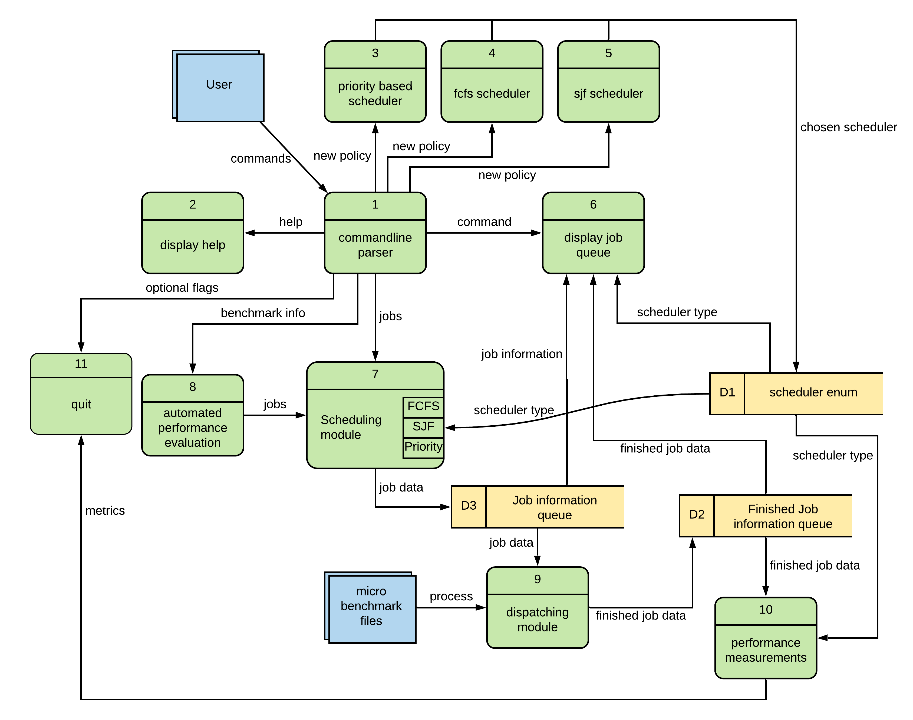
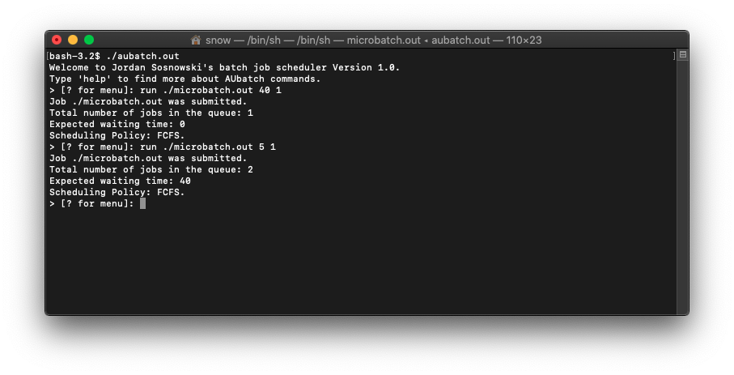
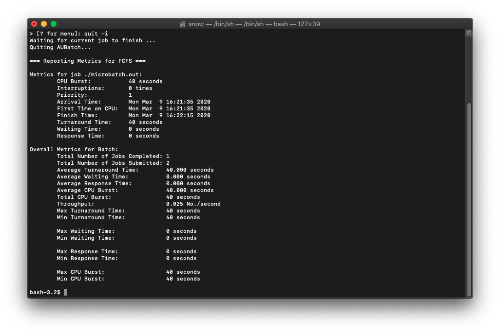
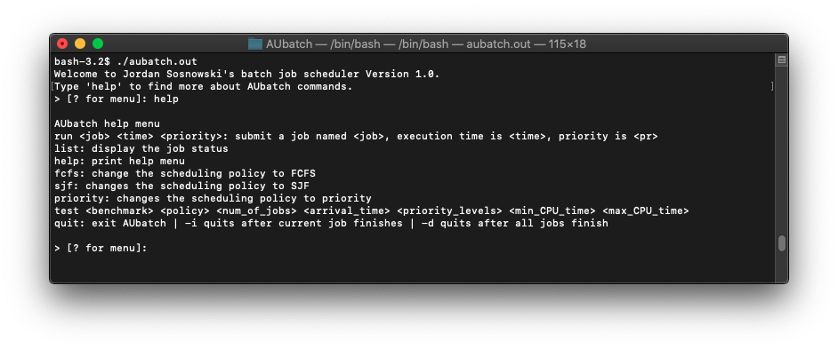
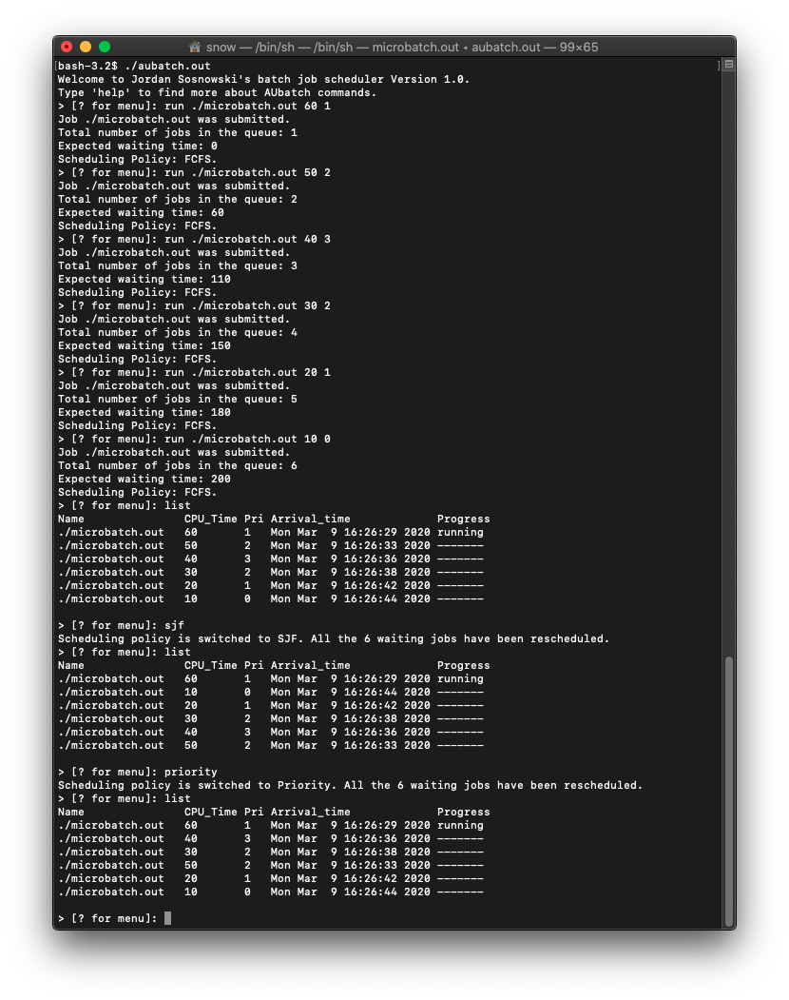
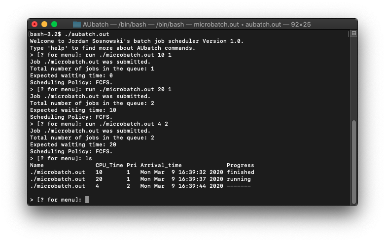
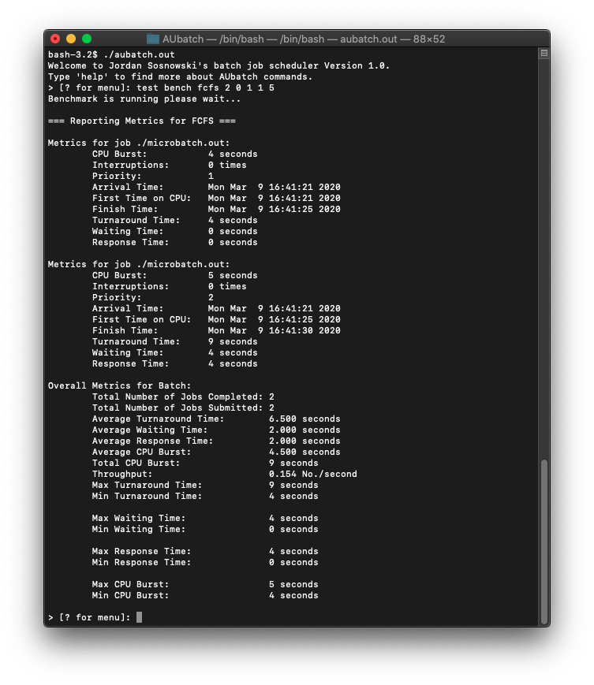

<!-- `pandoc report.md -o project.pdf --from markdown --template eisvogel --listing --toc` -->

\newpage

# Introduction

## I. Problem Description

Central processing units are the core of any computer.
Any program that has to run has to go through the CPU, as without the CPU the program cannot be executed.
However, one single program cannot fully utilize a CPU; therefore, if we were to leave a single program on the CPU until it is finished executing we would be wasting valuable time.
Imagine if you could only run one program at a time per CPU on a computer, that would be horrendous.
Therefore, it is important to keep a CPU as active as possible.
For example, if one program is busing doing I/O it should probably be booted off the CPU so a program that can use the CPU's resources can be loaded.
But which program should be loaded next?
AUBatch is a simulation that looks into process, or job, scheduling. We look into three algorithms: first come, first served, shortest job first, and priority-based.

Additionally, we assume all of our algorithms are non-preemptive, so once a process is loaded onto the CPU it is there until it is completed. 
Preemptive algorithms are extremely popular and efficient, as state earlier, but to implement one is out of scope for this current project.

## II. Background

To fully understand some of the algorithms and technologies discussed in this paper, a background in these methodologies needs to be established.

### Central Processing Unit

A central processing unit (CPU)^[1]^ is hardware that executes instructions that make up a computer program.
Also referred to as the brain of the computer, without it the computer would not be able to operate.
Most modern CPUs have multiple cores, each core can load a single thread of execution. Therefore a CPU with two cores can run two parallel processes.

### First Come, First Served

First come, first served (FCFS)^[2]^ is a scheduling algorithm that loads processes onto the CPU as they arrive.
Therefore, if three processes arrive in the following order A, C, B they will execute in the same order.

### Shortest Job First

Shortest job first (SJF)^[3]^, also known as shortest job next, loads processes based on the remaining CPU burst time. 
This scheduler minimizes response time as jobs are usually loaded faster.

### Priority Based

Priority based scheduling is similar to SJF. Instead of sorting by remaining CPU burst, it will sort based on priority (highest priority first, lowest last).
Our implementation of priority based is non-preemptive, most are preemptive.


# Design and Implementation

## I. Dataflow Diagram

Here we have the dataflow diagram for the AUBatch framework.
We have two external entities, user, and microbenchmark files.
There are 10 processes and 3 data stores.
Our `user` interacts with the `commandline parser` which will call a function depending on the input.

We can provide different scheduling types, help / h / ?, list/ls, run ..., test ..., and quit.

* `run` will call the `scheduling module` which will, in turn, load the job into the `job information queue` which is used by the `dispatching module` which when finished will load the finished job onto the `finished job information queue`.

* `list` will call the `display job queue` which pulls information from the `scheduler enum`, the `finished job information queue`, and the `job information queue`.

* `test` will call the `automated performance evaluation` process which sends jobs to the `scheduling module`.

* `fcfs` / `sjf` / `priority` will change the current scheduling algorithm by loading it into the `scheduler enum`.

* `quit` can take two optional flags `-i` or `-d`. `-i` will wait until the current job finished, `-d` will wait until all the jobs finish.
If no flag is provided it will simply quit immediately.



\newpage 

## II. Project Design

I decided to split up the project into three different files: `aubatch.c` contains the main method and is the driver for the entire process, `commandline.c` parses user input and decided how to react, `modules.c` contains the scheduler and dispatcher modules that are feed data from `commandline.c`.

Also, I have a helper file called `microbatch.c` which can be called by the user during benchmarks or runs.
It takes a command-line argument, which is handled by `run`, and will sleep for n seconds, where `n` is the command-line argument provided by the user.
It is matched with `cpu_burst_time`.
Therefore, if a user were to provide `run ./microbatch.out 10 1` it would call `system` with `./microbatch.out 10` and therefore instruct `microbatch` to sleep for 10 seconds.

I have two header files `commandline.h` and `modules.h` both are imported in `aubatch.c` and `modules.h` is imported in `commandline.c`.
Additionally, for error checking I make sure a binary exists before it is run via `run`, to do this I simply open the file and if it cannot open it warns the user.
Since `fopen` does not use the system path you will have to provide a full or relative path for binaries if you wish to run them.
For example `run ls 10 1` will not work but `run /bin/ls 10 1` will.

Also, packaged with the report are some script files that show me running aubatch under different conditions.

## III. AUBatch

I will say here before I get into the code discussion for any function that I was not familiar with I used `cplusplus`^[5]^ as reference material as it is an unofficial C/C++ API.
I also used `GeeksforGeeks`^[6]^ for some fundamental implementations such as how to use `qsort`.
Additionally, I used Dr. Qin's sample code as a base for most of this project.

The first module we will discuss is `aubatch.c`.
It is the driver for the whole framework and the only module with a main function.

We first include `commandline.h` and `modules.h` so we can gain the functionality of those two files.

```c++
#include "commandline.h"
#include "modules.h"
```

After the include statement, we flesh out main.
Within main we print the welcome message, and we declare and instantiate a multitude of variables used throughout `commandline.c` and `modules.c`.
Following this, we create two threads, one that calls `commandline` located in `commandline.c` and another that calls `dispatcher` which is located in `modules.c`.

`count` is used to determine the number of jobs in the waiting queue, plus the job that is currently on the CPU.
`buf_head` and `buf_tail` point to spots within `process_buffer` an array of running and waiting processes.
`buf_head` points to the next available spot in the array and `buf_tail` points to the next process that should be loaded, as specified by the scheduling algorithm, onto the CPU.
`finished_head` points to the next available spot in the `finished_process_buffer` an array of processes that have finished execution.
`batch` is used as a flag to denote whether we are adding jobs in batch mode or not.
This is only set to `1` when we do a benchmark with an arrival rate of 0.
This means we are assuming all the jobs are arriving at the same time.

Following this, we wait for the threads to join, and if they have return values we print them out.

```c++
int main(int argc, char **argv)
{
    printf("Welcome to Jordan Sosnowski's batch job scheduler Version 1.0.\nType 'help' to find more about AUbatch commands.\n");
    pthread_t executor_thread, dispatcher_thread; /* Two concurrent threads */

    int iret1, iret2;

    policy = FCFS; // default policy for scheduler

    /* Initialize count, three buffer pointers */
    count = 0;
    buf_head = 0;
    buf_tail = 0;
    finished_head = 0;
    batch = 0;

    /* Create two independent threads: executor and dispatcher */

    iret1 = pthread_create(&executor_thread, NULL, commandline, (void *)NULL);
    iret2 = pthread_create(&dispatcher_thread, NULL, dispatcher, (void *)NULL);

    /* Initialize the lock the two condition variables */
    pthread_mutex_init(&cmd_queue_lock, NULL);
    pthread_cond_init(&cmd_buf_not_full, NULL);
    pthread_cond_init(&cmd_buf_not_empty, NULL);

    /* Wait till threads are complete before main continues. Unless we  */
    /* wait we run the risk of executing an exit which will terminate   */
    /* the process and all threads before the threads have completed.   */
    pthread_join(executor_thread, NULL);
    pthread_join(dispatcher_thread, NULL);

    if (iret1)
        printf("executor_thread returns: %d\n", iret1);
    if (iret2)
        printf("dispatcher_thread returns: %d\n", iret1);
    return 0;
}
```

## IV. Commandline

Within `commandline.c` we include `modules.h` and `commandline.h`.

```c++
#include "commandline.h"
#include "modules.h"
```

Following this, we declare an array of strings that define the different values help should print out.

```c++
static const char *helpmenu[] = {
    "run <job> <time> <priority>: submit a job named <job>, execution time is <time>, priority is <pr>",
    "list: display the job status",
    "help: Print help menu",
    "fcfs: change the scheduling policy to FCFS",
    "sjf: changes the scheduling policy to SJF",
    "priority: changes the scheduling policy to priority",
    "test <benchmark> <policy> <num_of_jobs> <arrival_time> <priority_levels> <min_CPU_time> <max_CPU_time>",
    "quit: Exit AUbatch | -i quits after current job finishes | -d quits after all jobs finish",
    NULL};
```

Next, we define a custom type `cmd` which is a struct that houses a string and a function. After that, we define an array of `cmd`s. 
This will be used by `cmd_dispatch` to help decide which function to call based on the input value.

```c++
typedef struct
{
    const char *name;
    int (*func)(int nargs, char **args);
} cmd;

// array of cmds to be used by the command line
static const cmd cmdtable[] = {
    {"?", cmd_helpmenu},
    {"h", cmd_helpmenu},
    {"help", cmd_helpmenu},
    {"r", cmd_run},
    {"run", cmd_run},
    {"q", cmd_quit},
    {"quit", cmd_quit},
    {"fcfs", cmd_fcfs},
    {"sjf", cmd_sjf},
    {"priority", cmd_priority},
    {"list", cmd_list},
    {"ls", cmd_list},
    {"test", cmd_test},
    {NULL, NULL}};
```

After this, we hit `commandline` which is called by the executor thread back in `aubatch.c`.
This is where the command line gets input from the user to then determine what to do based on said input.

```c++
void *commandline(void *ptr)
{

    char *buffer;

    buffer = (char *)malloc(MAX_CMD_LEN * sizeof(char));
    if (buffer == NULL)
    {
        perror("Unable to malloc buffer");
        exit(1);
    }

    while (1)
    {
        printf("> [? for menu]: ");
        fgets(buffer, MAX_CMD_LEN, stdin);
        remove_newline(buffer);
        cmd_dispatch(buffer);
    }
    return (void *)NULL;
}
```

Next, we will look into `cmd_dispatch` this is the controller of `commandline` as it helps determine code flow.
Within this function we first determine the number of arguments, we assume arguments are space delimitated.
To determine the number of arguments we use `strtok` to tokenize the string.
If we send in a command that has more than 8 arguments we remind the user that they have provided more than the tool can handle.
If we provided `test bench1 fcfs 5 0 6 1 10` the arggs array would be as follows:
`args[0] = test`, `args[1] = bench`, `args[2] = fcfs`, `args[3] = 5`, `args[4] = 0`, `args[5] = 6`,
`args[6] = 1`, and `args[7] = 10`.

After that we loop through `cmdtable` to see if `args[0]` equals a function.
For example if we provided `run ./microbatch.out 10`, args[0] would equal `run` which matches with `cmd_run` in `cmdtable`. 
Once we find the correct function we call it and pass `args` and `nargs` as arguments.

```c++
int cmd_dispatch(char *cmd)
{
    char *args[MAXMENUARGS];
    int nargs = 0;
    char *word;
    char *context;
    int i, result;

    for (word = strtok_r(cmd, " ", &context);
         word != NULL;
         word = strtok_r(NULL, " ", &context))
    {

        if (nargs >= MAXMENUARGS)
        {
            printf("Command line has too many words\n");
            return E2BIG;
        }
        args[nargs++] = word;
    }

    if (nargs == 0)
    {
        return 0;
    }

    for (i = 0; cmdtable[i].name; i++)
    {
        if (*cmdtable[i].name && !strcmp(args[0], cmdtable[i].name))
        {
            assert(cmdtable[i].func != NULL);

            result = cmdtable[i].func(nargs, args);
            return result;
        }
    }

    printf("%s: Command not found\n", args[0]);
    return EINVAL;
}
```

What follows next are the implementations for each cmd function.



`cmd_run`, which is called via `run` or `r`, will check to ensure you passed the right number of parameters.
After that, it will call scheduler and pass it the command line arguments provided.

```c++
int cmd_run(int nargs, char **args)
{
    if (nargs != 4)
    {
        printf("Usage: run <job> <time> <priority>\n");
        return EINVAL;
    }
    // ensure file exists first
    FILE *f = fopen(args[1], "r");
    if (f == NULL)
    {
        printf("Error file does not exist. Please use relative or full path\n");
        fclose(f);
        return EINVAL;
    }
    fclose(f);
    scheduler(nargs, args);
    return 0; /* if succeed */
}
```



`cmd_quit`, which is called via `quit` or `q`, will first check and see if you passed any flags with it.
If you pass `-i` aubatch will wait for the current process on the CPU to finish. 
If you pass `-d` aubatch will wait for all processes to finish.

After waiting, or not waiting, it will call `report_metrics` and then exit.

```c++
int cmd_quit(int nargs, char **args)
{
    if (nargs == 2)
    {
        if (!strcmp(args[1], "-i")) // wait for current job to finish running
        {

            int cur_count = count;
            printf("Waiting for current job to finish ... \n");
            if (count)
            {
                while (cur_count == count)
                {
                }
            }
        }
        else if (!strcmp(args[1], "-d")) // wait for all jobs to finish
        {
            printf("Waiting for all jobs to finish...\n");
            while (count)
            {
            }
        }
    }
    printf("Quiting AUBatch... \n");

    report_metrics();

    exit(0);
}
```



`cmd_helpmenu`, which can be called with `help`, `h`, or `?`, will loop through each helpmenu array element and print to the screen for the user.

```c++
int cmd_helpmenu(int n, char **a)
{

    printf("\n");
    printf("AUbatch help menu\n");

    int i = 0;
    while (1)
    {
        if (helpmenu[i] == NULL)
        {
            break;
        }
        printf("%s\n", helpmenu[i]);
        i++;
    }
    printf("\n");
    return 0;
}
```


`cmd_priority`, which is called with `priority`, will change the current scheduling policy to priority based.

```c++
int cmd_priority()
{
    policy = PRIORITY;
    change_scheduler();
    return 0;
}
```

`cmd_sjf`, which is called with `sjf`, will change the current scheduling policy to the shortest job first.

```c++
int cmd_sjf()
{
    policy = SJF;
    change_scheduler();
    return 0;
}
```

`cmd_fcfs`, which is called with `fcfs`, will change the current scheduling policy to first come, first served.

```c++
int cmd_sjf()
{
    policy = FCFS;
    change_scheduler();
    return 0;
}
```

Each change in scheduling algorithm will also call `change_scheduler` which will print out some information to the screen for the user.
It will also resort to the buffer to ensure the processes are in the correct order for the new scheduler.

```c++
void change_scheduler()
{
    const char *str_policy = get_policy_string();
    printf("Scheduling policy is switched to %s. All the %d waiting jobs have been rescheduled.\n", str_policy, buf_head - buf_tail);
    sort_buffer(process_buffer);
}
```



`cmd_list`, which is called via `ls` or `list`, will list the running process, and all the finished and waiting processes and relevant information about them.
If you have no processes waiting, running, or finished it will notify you.

```c++
int cmd_list()
{
    if (finished_head || count)
    {
        printf("Name               CPU_Time Pri Arrival_time             Progress\n");
        int i;
        for (i = 0; i < finished_head; i++)
        {

            finished_process_p process = finished_process_buffer[i];
            char *status = "finished";

            char *time = convert_time(process->arrival_time);
            remove_newline(time);
            printf("%-18s %-8d %-3d %s %s\n",
                   process->cmd,
                   process->cpu_burst,
                   process->priority,
                   time,
                   status);
        }

        for (i = 0; i < buf_head; i++)
        {

            process_p process = process_buffer[i];
            char *status = "-------";
            if (process->cpu_remaining_burst == 0)
            {
                continue;
            }
            else if (process->first_time_on_cpu > 0 && process->cpu_remaining_burst > 0)
            {
                status = "running ";
            }

            char *time = convert_time(process->arrival_time);
            remove_newline(time);
            printf("%-18s %-8d %-3d %s %s\n",
                   process->cmd,
                   process->cpu_burst,
                   process->priority,
                   time,
                   status);
        }
        printf("\n");
    }
    else
        printf("No processes loaded yet!\n");
    return 0;
}
```



`cmd_test`, which is called with `test`, is the benchmark function. 
It takes 7 parameters: `benchmark_name`, `policy`, `num_of_jobs`, `arrival_rate`, `priority`, `min_cpu_burst`, and `max_cpu_burst`.
If the user does not provide the right number of arguments or provides logical fallacies such as `min_cpu_burst` > `max_cpu_burst` the user will be notified.
Additionally, for `test` to work, it assumes no other jobs have been run or are currently running.
It assumes that because if there are jobs currently on the CPU or jobs that need to be loaded it would mess with the metrics for the benchmark.

It calls `test_scheduler` which at a high level creates all the jobs needed for the benchmark and notifies `dispatcher` when appropriate.
After the jobs finish, we report the metrics, free all the jobs from the finished buffer, and reset the head and tail variables.

We use `while(count){}` to see if any jobs are waiting to run. For each job that is loaded onto `process_buffer` `count` is incremented and for each job that is take off `count` is decremented. Therefore, once `count` is `0` we know there are no longer any jobs.

I could have used a conditional variable for this but decided not to.

```c++
int cmd_test(int nargs, char **argv)
{

    srand(0); // ensure seed is set to the same value each time to make same jobs created
    if (nargs != 8)
    {
        printf("Usage: test <benchmark> <policy> <num_of_jobs> <arrival_rate> <priority_levels> <min_CPU_time> <max_CPU_time>\n");
        return EINVAL;
    }
    else if (count || finished_head)
    {
        printf("Error: Jobs current in queue / on CPU, no jobs should have ran if doing benchmark...\n");
        return EINVAL;
    }
    char *benchmark = argv[1];
    char *str_policy = argv[2];
    int num_of_jobs = atoi(argv[3]);
    int arrival_rate = atoi(argv[4]);
    int priority_levels = atoi(argv[5]);
    int min_cpu_burst = atoi(argv[6]);
    int max_cpu_burst = atoi(argv[7]);

    if (min_cpu_burst >= max_cpu_burst)
    {
        printf("Error: <min_CPU_time> cannot be greater than or equal to <max_CPU_time>\n");
        return EINVAL;
    }
    else if (num_of_jobs <= 0 || min_cpu_burst < 0 || max_cpu_burst < 0 || priority_levels < 0 || arrival_rate < 0)
    {
        printf("Error: <num_of_jobs> cannot be equal or less than zero\nError: <min_CPU_time> <max_CPU_time> <arrival_rate> and <priority_levels> must be greater than 0\n");
        return EINVAL;
    }

    if (!strcmp(str_policy, "fcfs"))
    {
        policy = FCFS;
    }
    else if (!strcmp(str_policy, "sjf"))
    {
        policy = SJF;
    }
    else if (!strcmp(str_policy, "priority"))
    {
        policy = PRIORITY;
    }
    else
    {
        printf("Error: <policy> must be either fcfs, sjf, or priority\n");
        return EINVAL;
    }

    test_scheduler(benchmark, num_of_jobs, arrival_rate, priority_levels, min_cpu_burst, max_cpu_burst);
    printf("Benchmark is running please wait...\n");
    while (count)
    {
    }

    report_metrics();

    // clear process queue and finished queue
    // ensures that the metrics aren't reported when quitting aubatch
    // also ensures if running metrics again that the prior jobs will not interfere
    int i;
    for (i = 0; i < finished_head; i++)
    {
        free(finished_process_buffer[i]);
    }
    finished_head = 0;
    buf_head = 0;
    buf_tail = 0;

    return 0;
}
```

## V. Modules

`modules.c` contain the schedulers and dispatcher, without this file the process specified in `run` or `test` would not be able to `run`.
`commandline` is simply an interface that interacts with the functions within `modules.c`

Therefore, within `modules.c` we only import `modules.h`.

```c++
#include "modules.h"
```

First we have `test_scheduler`, which is called by `cmd_test` in `commandline.c`.
This function will use mutexes and condition variables to ensure there are no issues among threads.

```c++
pthread_mutex_lock(&cmd_queue_lock);

while (count == CMD_BUF_SIZE)
{
    pthread_cond_wait(&cmd_buf_not_full, &cmd_queue_lock);
}

pthread_mutex_unlock(&cmd_queue_lock);
```
After ensuring there are no issues and it is `test_schedulers` time to run we will enter a `for` loop.
We will loop for `num_of_jobs`, this will allow us to create the number of jobs specified by `cmd_test`.
We create `process` which is of type `process_p`; a pointer to `process_t` which is a custom type of a struct that holds all the information we need about a process.
For `test_scheduler` we assume that each cmd to be run by the process will be `./microbatch.out` which is a file that simply sleeps for `n` seconds.
This will allow us to get a more accurate CPU burst time.
We randomly generate the priority and cpu_burst based on the seed set in `cmd_test`. We set the seed to 0 for each time we call `cmd_test` to make sure each time we call benchmark the same jobs are created.
If we do not ensure this we cannot accurately compare runs across different scheduling policies.
If we provide an `arrival_rate` > 0 we will need to load the jobs and notify the dispatcher each time to ensure more accurate metrics.
After we notify the dispatcher we will need to sleep for `arrival_rate` seconds.
If `arrival_rate` is 0 we assume all the processes arrive at the same time, therefore, we create them all and load them onto the buffer and only once they are all created will we notify `dispatcher`.

If our loop increment becomes larger than `CMD_BUF_SIZE` we need to notify the dispatcher ahead of time to ensure our queue does not overflow.

```c++
if (!arrival_rate)
    batch = 1;
else
    batch = 0;

// create jobs based on num_of_jobs
int i;
for (i = 0; i < num_of_jobs; i++)
{
    /* lock the shared command queue */
    pthread_mutex_lock(&cmd_queue_lock);

    while (count == CMD_BUF_SIZE)
    {
        pthread_cond_wait(&cmd_buf_not_full, &cmd_queue_lock);
    }

    pthread_mutex_unlock(&cmd_queue_lock);

    int priority = (rand() % (priority_levels + 1)) + 1;
    int cpu_burst = (rand() % (max_CPU_time + 1)) + min_CPU_time;
    process_p process = malloc(sizeof(process_t));
    strcpy(process->cmd, "./microbatch.out");
    process->arrival_time = time(NULL);
    process->cpu_burst = cpu_burst;
    process->cpu_remaining_burst = cpu_burst;
    process->priority = priority;
    process->interruptions = 0;
    process->first_time_on_cpu = 0;

    if (i >= CMD_BUF_SIZE) // if i is larger than cmd_buff we need to notify dispatcher earlier
    // without this we would be stuck forever
    {
        pthread_mutex_lock(&cmd_queue_lock);
        while (count == CMD_BUF_SIZE)
        {
            pthread_cond_wait(&cmd_buf_not_full, &cmd_queue_lock);
        }
        pthread_mutex_unlock(&cmd_queue_lock);
        pthread_mutex_lock(&cmd_queue_lock);
        process_buffer[buf_head] = process;
        count++;

        /* Move buf_head forward, this is a circular queue */
        buf_head++;
        sort_buffer(process_buffer);
        buf_head %= CMD_BUF_SIZE;
        /* Unlock the shared command queue */

        pthread_cond_signal(&cmd_buf_not_empty);
        pthread_mutex_unlock(&cmd_queue_lock);
    }
    else if (arrival_rate) // if there is an arrival rate, notify dispatcher immediately and then sleep for arrival_rate
    {

        pthread_mutex_lock(&cmd_queue_lock);
        process_buffer[buf_head] = process;
        count++;
        /* Move buf_head forward, this is a circular queue */
        buf_head++;

        sort_buffer(process_buffer);
        buf_head %= CMD_BUF_SIZE;
        /* Unlock the shared command queue */

        pthread_cond_signal(&cmd_buf_not_empty);
        pthread_mutex_unlock(&cmd_queue_lock);
        sleep(arrival_rate); // wait for the arrival rate
    }
    else
    {
        pthread_mutex_lock(&cmd_queue_lock);
        process_buffer[buf_head] = process;
        count++;

        /* Move buf_head forward, this is a circular queue */
        buf_head++;
        sort_buffer(process_buffer);
        buf_head %= CMD_BUF_SIZE;

        pthread_mutex_unlock(&cmd_queue_lock);
    }
}
if (!arrival_rate) // if arrival rate is 0, load all the jobs and then notify dispatcher
{
    pthread_mutex_lock(&cmd_queue_lock);

    sort_buffer(process_buffer);

    /* Unlock the shared command queue */

    pthread_cond_signal(&cmd_buf_not_empty);
    pthread_mutex_unlock(&cmd_queue_lock);
}
```

`scheduler` is called by `cmd_run` unlike `test_scheduler` this only loads one job at a time. Immediately after loading the job it always notifies dispatcher so the job can immediately start processing.

We pass `get_process` `argv` which simply transforms the provides user arguments into `process_p` a pointer to `process_t` which is a custom type of a struct that holds all the information we need about a process.
After this, we call `submit_job` which simply prints some useful information to the screen for the user.
After that, we load the process onto the buffer, increment count and buf_head, and sort the buffer with `sort_buffer`.

After all this, we notify `dispatcher` with `pthread_cond_signal`.

```c++
void scheduler(int argc, char **argv)
{
    /* lock the shared command queue */
    pthread_mutex_lock(&cmd_queue_lock);

    while (count == CMD_BUF_SIZE)
    {
        pthread_cond_wait(&cmd_buf_not_full, &cmd_queue_lock);
    }

    pthread_mutex_unlock(&cmd_queue_lock);
    process_p process = get_process(argv);

    // print information about job
    submit_job(process->cmd);

    process_buffer[buf_head] = process;
    pthread_mutex_lock(&cmd_queue_lock);

    count++;

    /* Move buf_head forward, this is a circular queue */
    buf_head++;
    buf_head %= CMD_BUF_SIZE;

    // ensure buffer is in accordance to current policy
    sort_buffer(process_buffer);

    /* Unlock the shared command queue */
    pthread_cond_signal(&cmd_buf_not_empty);
    pthread_mutex_unlock(&cmd_queue_lock);
}
```

`dispatcher` will grab the process from `buf_tail` as the sorting algorithm places the next process to be scheduled at the bottom of the queue. After we grab it off we call `complete_process` which runs the process and then loads up a completed process type and loads it onto another buffer. 

After we return we decrement the count and move our tail forward.
We will also set our `running_process` to `NULL`.

```c++
void *dispatcher(void *ptr)
{

    while (1)
    {

        /* lock and unlock for the shared process queue */
        pthread_mutex_lock(&cmd_queue_lock);

        // printf("In dispatcher: count = %d\n", count);

        while (count == 0)
        {
            pthread_cond_wait(&cmd_buf_not_empty, &cmd_queue_lock);
        }
        running_process = process_buffer[buf_tail];

        pthread_cond_signal(&cmd_buf_not_full);
        /* Unlock the shared command queue */
        pthread_mutex_unlock(&cmd_queue_lock);

        complete_process(running_process);
        /* Run the command scheduled in the queue */
        count--;

        // printf("In dispatcher: process_buffer[%d] = %s\n", buf_tail, process_buffer[buf_tail]->cmd);

        /* Move buf_tail forward, this is a circular queue */
        buf_tail++;
        buf_tail %= CMD_BUF_SIZE;

        running_process = NULL;
    }
    return (void *)NULL;
}
```

Within `calculate_wait` which is called by `submit_job`, we estimate the wait time for the newest process. By wait time we mean the amount of time it will have to wait before it is loaded onto the CPU.

```c++
int calculate_wait()
{
    int wait = 0;
    int i;
    for (i = buf_tail; i < buf_head; i++)
    {
        wait += process_buffer[i]->cpu_remaining_burst;
    }
    return wait;
}
```

`get_process` which is called by `scheduler` takes in a string array and loads up the process's variables. 
```c++
process_p get_process(char **argv)
{
    process_p process = malloc(sizeof(process_t));
    remove_newline(argv[3]);

    // load process structure
    strcpy(process->cmd, argv[1]);
    process->arrival_time = time(NULL);
    process->cpu_burst = atoi(argv[2]);
    process->cpu_remaining_burst = process->cpu_burst;
    process->priority = atoi(argv[3]);
    process->interruptions = 0;
    process->first_time_on_cpu = 0;
    return process;
}
```

`complete_process` which is called in `dispatcher` performs all the commands needed when finishing a process.
First, we will run the process, if the process's cmd is `./microbatch.out` we will append the burst time to it and call system. `microbatch.out` expects an additional command and uses that to determine how long to sleep for.

If we don't provide that program we will simply just run it using `system`.
However, we will run the command but pipe its output to `/dev/null` this unclutters our view.
For example, if we were to run `/bin/ls` when it lists the files of the current directory it sends that to `/dev/null` instead of standard output.

After that, we create `finished_process`, of type `finished_process_p` a pointer to `finished_process_t`. 
This is similar to `process_t` except is has variables that are related to metrics.

After we create this variable we load its fields and then increment `finished_head` and free the original processes' memory.

```c++
void complete_process(process_p process)
{
    char cmd[MAX_CMD_LEN * 2];
    if (!strcmp(process->cmd, "./microbatch.out"))
        sprintf(cmd, "%s %d", process->cmd, process->cpu_remaining_burst);
    else
        sprintf(cmd, "%s > /dev/null", process->cmd);

    if (process->first_time_on_cpu == 0)
        process->first_time_on_cpu = time(NULL);

    system(cmd);

    process->cpu_remaining_burst = 0;

    finished_process_p finished_process = malloc(sizeof(finished_process_t));
    finished_process->finish_time = time(NULL);

    //allows more accurate cpu burst, if we run ls 10 1, ls wont actually run for 10 seconds, therefore we need to update its burst time
    process->cpu_burst = (int)(finished_process->finish_time - process->first_time_on_cpu);

    strcpy(finished_process->cmd, process->cmd);
    finished_process->arrival_time = process->arrival_time;
    finished_process->cpu_burst = process->cpu_burst;
    finished_process->interruptions = process->interruptions;
    finished_process->priority = process->priority;
    finished_process->first_time_on_cpu = process->first_time_on_cpu;
    finished_process->turnaround_time = finished_process->finish_time - finished_process->arrival_time;
    if (finished_process->turnaround_time)
        finished_process->waiting_time = finished_process->turnaround_time - finished_process->cpu_burst;
    else
        finished_process->waiting_time = 0;

    finished_process->response_time = finished_process->first_time_on_cpu - finished_process->arrival_time;

    finished_process_buffer[finished_head] = finished_process;
    finished_head++;

    free(process);
}
```

Next, we will discuss `report_metrics`.
This function is called by `commandline` whenever we quit.
It is a lot of code, but all it does it iterate through each finished process and print relative metrics.

It also takes note of specific metrics through each process so it can average them or get the min/max at the end.

```c++
void report_metrics()
{
    if (!finished_head)
    {
        printf("No jobs completed!\n");
        return;
    }
    int total_waiting_time = 0;
    int total_turnaround_time = 0;
    int total_response_time = 0;
    int total_cpu_burst = 0;

    int max_waiting_time = INT_MIN;
    int min_waiting_time = INT_MAX;
    int max_response_time = INT_MIN;
    int min_response_time = INT_MAX;
    int max_turnaround_time = INT_MIN;
    int min_turnaround_time = INT_MAX;
    int max_cpu_burst = INT_MIN;
    int min_cpu_burst = INT_MAX;

    printf("\n=== Reporting Metrics for %s ===\n\n", get_policy_string());
    finished_process_p finished_process;
    int i = 0;
    for (; i < finished_head; i++)
    {
        finished_process = finished_process_buffer[i];

        printf("Metrics for job %s:\n", finished_process->cmd);
        printf("\tCPU Burst:           %d seconds\n", finished_process->cpu_burst);
        printf("\tInterruptions:       %d times\n", finished_process->interruptions);
        printf("\tPriority:            %d\n", finished_process->priority);

        printf("\tArrival Time:        %s", convert_time(finished_process->arrival_time));
        printf("\tFirst Time on CPU:   %s", convert_time(finished_process->first_time_on_cpu));
        printf("\tFinish Time:         %s", convert_time(finished_process->finish_time));

        printf("\tTurnaround Time:     %d seconds\n", finished_process->turnaround_time);
        printf("\tWaiting Time:        %d seconds\n", finished_process->waiting_time);
        printf("\tResponse Time:       %d seconds\n", finished_process->response_time);
        printf("\n");

        if (finished_process->waiting_time < min_waiting_time)
            min_waiting_time = finished_process->waiting_time;
        if (finished_process->turnaround_time < min_turnaround_time)
            min_turnaround_time = finished_process->turnaround_time;
        if (finished_process->response_time < min_response_time)
            min_response_time = finished_process->response_time;
        if (finished_process->cpu_burst < min_cpu_burst)
            min_cpu_burst = finished_process->cpu_burst;

        if (finished_process->waiting_time > max_waiting_time)
            max_waiting_time = finished_process->waiting_time;
        if (finished_process->turnaround_time > max_response_time)
            max_turnaround_time = finished_process->turnaround_time;
        if (finished_process->response_time > max_response_time)
            max_response_time = finished_process->response_time;
        if (finished_process->cpu_burst > max_cpu_burst)
            max_cpu_burst = finished_process->cpu_burst;

        total_response_time += finished_process->response_time;
        total_waiting_time += finished_process->waiting_time;
        total_turnaround_time += finished_process->turnaround_time;
        total_cpu_burst += finished_process->cpu_burst;
    }

    printf("Overall Metrics for Batch:\n");
    printf("\tTotal Number of Jobs Completed: %d\n", finished_head);
    printf("\tTotal Number of Jobs Submitted: %d\n", finished_head + (buf_head - buf_tail));
    printf("\tAverage Turnaround Time:        %.3f seconds\n", total_turnaround_time / (float)i);
    printf("\tAverage Waiting Time:           %.3f seconds\n", total_waiting_time / (float)i);
    printf("\tAverage Response Time:          %.3f seconds\n", total_response_time / (float)i);
    printf("\tAverage CPU Burst:              %.3f seconds\n", total_cpu_burst / (float)i);
    printf("\tTotal CPU Burst:                %d seconds\n", total_cpu_burst);
    printf("\tThroughput:                     %.3f No./second\n", 1 / (total_turnaround_time / (float)i));

    printf("\tMax Turnaround Time:            %d seconds\n", max_turnaround_time);
    printf("\tMin Turnaround Time:            %d seconds\n\n", min_turnaround_time);

    printf("\tMax Waiting Time:               %d seconds\n", max_waiting_time);
    printf("\tMin Waiting Time:               %d seconds\n\n", min_waiting_time);

    printf("\tMax Response Time:              %d seconds\n", max_response_time);
    printf("\tMin Response Time:              %d seconds\n\n", min_response_time);

    printf("\tMax CPU Burst:                  %d seconds\n", max_cpu_burst);
    printf("\tMin CPU Burst:                  %d seconds\n\n", min_cpu_burst);
}
```

`sort_buffer` is the implementation of the scheduling policy.
We first determine which policy we are running, we do this to determine at run-time which sorting algorithm to run.

After this, we use `qsort` to sort the `process_buffer`.
Note we do something weird with `process_buffer`. We get the element at `buf_tail`, this ensures we get the current process that is not on the CPU. Then we get the address of this and pass it to qsort.
We also only run for `buf_head - buf_tail` iterations. It is for the same reason as the prior command.
If we were to remove the process of the buffer once it is run this would solve this but this workaround works.

```c++
void sort_buffer(process_p *process_buffer)
{
    void *sort;
    switch (policy)
    {
    case FCFS:
        sort = fcfs_scheduler;
        break;
    case SJF:
        sort = sjf_scheduler;
        break;
    case PRIORITY:
        sort = priority_scheduler;
    }

    int index;

    // if we are doing a batch job, aka arrival rate is not 0 then add 1 to buf_tail
    // if we sort ahead of buf_tail for a batch job we will all the processes even tho
    // none are currently on the CPU
    if (!batch)
        index = buf_tail + 1;
    else
        index = buf_tail;
    qsort(&process_buffer[index], buf_head - index, sizeof(process_p), sort);
}
```

What follows next is implementations for the sorting algorithms.

First, we have `sjf_scheduler` this sorts based on `cpu_remaining_burst`.

```c++
int sjf_scheduler(const void *a, const void *b)
{

    process_p process_a = *(process_p *)a;
    process_p process_b = *(process_p *)b;

    return (process_a->cpu_remaining_burst - process_b->cpu_remaining_burst);
}
```

Next, we have `fcfs_scheduler` which sorts based on arrival time.

```c++
int fcfs_scheduler(const void *a, const void *b)
{

    process_p process_a = *(process_p *)a;
    process_p process_b = *(process_p *)b;

    return (process_a->arrival_time - process_b->arrival_time);
}
```

Finally, we have `priority_scheduler` which sorts based on priority.
Note the final calculation is swapped. This is because we are sorting with the highest priority goes first and the lowest priority goes last.

```c++
int priority_scheduler(const void *a, const void *b)
{

    process_p process_a = *(process_p *)a;
    process_p process_b = *(process_p *)b;

    return (-process_a->priority + process_b->priority);
}
```

What comes next are some utility functions that just help with ease of use.

First, we have a function that takes in a buffer and removes a trailing newline.
```c++
void remove_newline(char *buffer)
{
    int string_length = strlen(buffer);
    if (buffer[string_length - 1] == '\n')
    {
        buffer[string_length - 1] = '\0';
    }
}
```

Next, we have a function that takes in time and returns the human-readable string version of it.
```c++
char *convert_time(time_t time)
{
    return asctime(localtime(&time));
}
```

`get_policy_string` will return the human readable string of the current policy.
```c++
char *get_policy_string()
{
    switch (policy)
    {
    case FCFS:
        return "FCFS";

    case SJF:
        return "SJF";

    case PRIORITY:
        return "Priority";

    default:
        return "Unknown";
    }
}
```

`submit_job` will print out useful information for the user when submitting a job.
This includes the name of the job, the number of jobs in the queue, the expected waiting time, and the scheduling policy.
```c++
void submit_job(const char *cmd)
{
    const char *str_policy = get_policy_string();
    printf("Job %s was submitted.\n", cmd);
    printf("Total number of jobs in the queue: %d\n", count + 1);
    printf("Expected waiting time: %d\n",
           calculate_wait());
    printf("Scheduling Policy: %s.\n", str_policy);
}
```

\newpage

# Performance Metrics

Note: for all performance evaluation I used `microbatch.out` which is a sample program that simply sleeps for `n` seconds, while `n` is provided by the user.

## Instant Arrival

With this benchmark, we show how the scheduling algorithms perform when all the jobs arrive at the same time.

### First Come First Served, 5 Jobs, Arrival Time 0, Priority Range 0-5, CPU Burst Range 0-10

```
> [? for menu]: test bench1 fcfs 5 0 5 0 10
Benchmark is running please wait...

=== Reporting Metrics for FCFS ===

Metrics for job ./microbatch.out:
    CPU Burst:           4 seconds
    Interruptions:       0 times
    Priority:            1
    Arrival Time:        Sun Mar  8 20:06:21 2020
    First Time on CPU:   Sun Mar  8 20:06:21 2020
    Finish Time:         Sun Mar  8 20:06:25 2020
    Turnaround Time:     4 seconds
    Waiting Time:        0 seconds
    Response Time:       0 seconds

Metrics for job ./microbatch.out:
    CPU Burst:           5 seconds
    Interruptions:       0 times
    Priority:            6
    Arrival Time:        Sun Mar  8 20:06:21 2020
    First Time on CPU:   Sun Mar  8 20:06:25 2020
    Finish Time:         Sun Mar  8 20:06:30 2020
    Turnaround Time:     9 seconds
    Waiting Time:        4 seconds
    Response Time:       4 seconds

Metrics for job ./microbatch.out:
    CPU Burst:           6 seconds
    Interruptions:       0 times
    Priority:            2
    Arrival Time:        Sun Mar  8 20:06:21 2020
    First Time on CPU:   Sun Mar  8 20:06:30 2020
    Finish Time:         Sun Mar  8 20:06:36 2020
    Turnaround Time:     15 seconds
    Waiting Time:        9 seconds
    Response Time:       9 seconds

Metrics for job ./microbatch.out:
    CPU Burst:           0 seconds
    Interruptions:       0 times
    Priority:            5
    Arrival Time:        Sun Mar  8 20:06:21 2020
    First Time on CPU:   Sun Mar  8 20:06:36 2020
    Finish Time:         Sun Mar  8 20:06:36 2020
    Turnaround Time:     15 seconds
    Waiting Time:        15 seconds
    Response Time:       15 seconds

Metrics for job ./microbatch.out:
    CPU Burst:           8 seconds
    Interruptions:       0 times
    Priority:            3
    Arrival Time:        Sun Mar  8 20:06:21 2020
    First Time on CPU:   Sun Mar  8 20:06:36 2020
    Finish Time:         Sun Mar  8 20:06:44 2020
    Turnaround Time:     23 seconds
    Waiting Time:        15 seconds
    Response Time:       15 seconds

Overall Metrics for Batch:
    Total Number of Jobs Completed: 5
    Total Number of Jobs Submitted: 5
    Average Turnaround Time:        13.200 seconds
    Average Waiting Time:           8.600 seconds
    Average Response Time:          8.600 seconds
    Average CPU Burst:              4.600 seconds
    Total CPU Burst:                23 seconds
    Throughput:                     0.076 No./second
    Max Turnaround Time:            23 seconds
    Min Turnaround Time:            4 seconds

    Max Waiting Time:               15 seconds
    Min Waiting Time:               0 seconds

    Max Response Time:              15 seconds
    Min Response Time:              0 seconds

    Max CPU Burst:                  8 seconds
    Min CPU Burst:                  0 seconds
```

\newpage

### Shortest Job First, 5 Jobs, Arrival Time 0, Priority Range 0-5, CPU Burst Range 0-10

```
> [? for menu]: test bench2 sjf 5 0 5 0 10
Benchmark is running please wait...

=== Reporting Metrics for SJF ===

Metrics for job ./microbatch.out:
    CPU Burst:           0 seconds
    Interruptions:       0 times
    Priority:            5
    Arrival Time:        Sun Mar  8 20:10:20 2020
    First Time on CPU:   Sun Mar  8 20:10:20 2020
    Finish Time:         Sun Mar  8 20:10:20 2020
    Turnaround Time:     0 seconds
    Waiting Time:        0 seconds
    Response Time:       0 seconds

Metrics for job ./microbatch.out:
    CPU Burst:           3 seconds
    Interruptions:       0 times
    Priority:            1
    Arrival Time:        Sun Mar  8 20:10:20 2020
    First Time on CPU:   Sun Mar  8 20:10:20 2020
    Finish Time:         Sun Mar  8 20:10:23 2020
    Turnaround Time:     3 seconds
    Waiting Time:        0 seconds
    Response Time:       0 seconds

Metrics for job ./microbatch.out:
    CPU Burst:           5 seconds
    Interruptions:       0 times
    Priority:            6
    Arrival Time:        Sun Mar  8 20:10:20 2020
    First Time on CPU:   Sun Mar  8 20:10:23 2020
    Finish Time:         Sun Mar  8 20:10:28 2020
    Turnaround Time:     8 seconds
    Waiting Time:        3 seconds
    Response Time:       3 seconds

Metrics for job ./microbatch.out:
    CPU Burst:           6 seconds
    Interruptions:       0 times
    Priority:            2
    Arrival Time:        Sun Mar  8 20:10:20 2020
    First Time on CPU:   Sun Mar  8 20:10:28 2020
    Finish Time:         Sun Mar  8 20:10:34 2020
    Turnaround Time:     14 seconds
    Waiting Time:        8 seconds
    Response Time:       8 seconds

Metrics for job ./microbatch.out:
    CPU Burst:           8 seconds
    Interruptions:       0 times
    Priority:            3
    Arrival Time:        Sun Mar  8 20:10:20 2020
    First Time on CPU:   Sun Mar  8 20:10:34 2020
    Finish Time:         Sun Mar  8 20:10:42 2020
    Turnaround Time:     22 seconds
    Waiting Time:        14 seconds
    Response Time:       14 seconds

Overall Metrics for Batch:
    Total Number of Jobs Completed: 5
    Total Number of Jobs Submitted: 5
    Average Turnaround Time:        9.400 seconds
    Average Waiting Time:           5.000 seconds
    Average Response Time:          5.000 seconds
    Average CPU Burst:              4.400 seconds
    Total CPU Burst:                22 seconds
    Throughput:                     0.106 No./second
    Max Turnaround Time:            22 seconds
    Min Turnaround Time:            0 seconds

    Max Waiting Time:               14 seconds
    Min Waiting Time:               0 seconds

    Max Response Time:              14 seconds
    Min Response Time:              0 seconds

    Max CPU Burst:                  8 seconds
    Min CPU Burst:                  0 seconds
```

\newpage

### Priority Based, 5 Jobs, Arrival Time 0, Priority Range 0-5, CPU Burst Range 0-10

```
> [? for menu]: test bench3 priority 5 0 5 0 10
Benchmark is running please wait...

=== Reporting Metrics for Priority ===

Metrics for job ./microbatch.out:
    CPU Burst:           5 seconds
    Interruptions:       0 times
    Priority:            6
    Arrival Time:        Sun Mar  8 20:13:07 2020
    First Time on CPU:   Sun Mar  8 20:13:07 2020
    Finish Time:         Sun Mar  8 20:13:12 2020
    Turnaround Time:     5 seconds
    Waiting Time:        0 seconds
    Response Time:       0 seconds

Metrics for job ./microbatch.out:
    CPU Burst:           0 seconds
    Interruptions:       0 times
    Priority:            5
    Arrival Time:        Sun Mar  8 20:13:07 2020
    First Time on CPU:   Sun Mar  8 20:13:12 2020
    Finish Time:         Sun Mar  8 20:13:12 2020
    Turnaround Time:     5 seconds
    Waiting Time:        5 seconds
    Response Time:       5 seconds

Metrics for job ./microbatch.out:
    CPU Burst:           8 seconds
    Interruptions:       0 times
    Priority:            3
    Arrival Time:        Sun Mar  8 20:13:07 2020
    First Time on CPU:   Sun Mar  8 20:13:12 2020
    Finish Time:         Sun Mar  8 20:13:20 2020
    Turnaround Time:     13 seconds
    Waiting Time:        5 seconds
    Response Time:       5 seconds

Metrics for job ./microbatch.out:
    CPU Burst:           6 seconds
    Interruptions:       0 times
    Priority:            2
    Arrival Time:        Sun Mar  8 20:13:07 2020
    First Time on CPU:   Sun Mar  8 20:13:20 2020
    Finish Time:         Sun Mar  8 20:13:26 2020
    Turnaround Time:     19 seconds
    Waiting Time:        13 seconds
    Response Time:       13 seconds

Metrics for job ./microbatch.out:
    CPU Burst:           3 seconds
    Interruptions:       0 times
    Priority:            1
    Arrival Time:        Sun Mar  8 20:13:07 2020
    First Time on CPU:   Sun Mar  8 20:13:26 2020
    Finish Time:         Sun Mar  8 20:13:29 2020
    Turnaround Time:     22 seconds
    Waiting Time:        19 seconds
    Response Time:       19 seconds

Overall Metrics for Batch:
    Total Number of Jobs Completed: 5
    Total Number of Jobs Submitted: 5
    Average Turnaround Time:        12.800 seconds
    Average Waiting Time:           8.400 seconds
    Average Response Time:          8.400 seconds
    Average CPU Burst:              4.400 seconds
    Total CPU Burst:                22 seconds
    Throughput:                     0.078 No./second
    Max Turnaround Time:            22 seconds
    Min Turnaround Time:            5 seconds

    Max Waiting Time:               19 seconds
    Min Waiting Time:               0 seconds

    Max Response Time:              19 seconds
    Min Response Time:              0 seconds

    Max CPU Burst:                  8 seconds
    Min CPU Burst:                  0 seconds
```

\newpage

## Two Second Arrival

Here we show how the scheduling algorithms differ when they do not arrive at the same time.

### First Come First Served, 5 Jobs, Arrival Time 2, Priority Range 0-5, CPU Burst Range 0-10

```
> [? for menu]: test bench1 fcfs 5 2 5 0 10
Benchmark is running please wait...

=== Reporting Metrics for FCFS ===

Metrics for job ./microbatch.out:
    CPU Burst:           3 seconds
    Interruptions:       0 times
    Priority:            1
    Arrival Time:        Sun Mar  8 20:14:50 2020
    First Time on CPU:   Sun Mar  8 20:14:50 2020
    Finish Time:         Sun Mar  8 20:14:53 2020
    Turnaround Time:     3 seconds
    Waiting Time:        0 seconds
    Response Time:       0 seconds

Metrics for job ./microbatch.out:
    CPU Burst:           5 seconds
    Interruptions:       0 times
    Priority:            6
    Arrival Time:        Sun Mar  8 20:14:52 2020
    First Time on CPU:   Sun Mar  8 20:14:53 2020
    Finish Time:         Sun Mar  8 20:14:58 2020
    Turnaround Time:     6 seconds
    Waiting Time:        1 seconds
    Response Time:       1 seconds

Metrics for job ./microbatch.out:
    CPU Burst:           6 seconds
    Interruptions:       0 times
    Priority:            2
    Arrival Time:        Sun Mar  8 20:14:54 2020
    First Time on CPU:   Sun Mar  8 20:14:58 2020
    Finish Time:         Sun Mar  8 20:15:04 2020
    Turnaround Time:     10 seconds
    Waiting Time:        4 seconds
    Response Time:       4 seconds

Metrics for job ./microbatch.out:
    CPU Burst:           0 seconds
    Interruptions:       0 times
    Priority:            5
    Arrival Time:        Sun Mar  8 20:14:56 2020
    First Time on CPU:   Sun Mar  8 20:15:04 2020
    Finish Time:         Sun Mar  8 20:15:04 2020
    Turnaround Time:     8 seconds
    Waiting Time:        8 seconds
    Response Time:       8 seconds

Metrics for job ./microbatch.out:
    CPU Burst:           8 seconds
    Interruptions:       0 times
    Priority:            3
    Arrival Time:        Sun Mar  8 20:14:58 2020
    First Time on CPU:   Sun Mar  8 20:15:04 2020
    Finish Time:         Sun Mar  8 20:15:12 2020
    Turnaround Time:     14 seconds
    Waiting Time:        6 seconds
    Response Time:       6 seconds

Overall Metrics for Batch:
    Total Number of Jobs Completed: 5
    Total Number of Jobs Submitted: 5
    Average Turnaround Time:        8.200 seconds
    Average Waiting Time:           3.800 seconds
    Average Response Time:          3.800 seconds
    Average CPU Burst:              4.400 seconds
    Total CPU Burst:                22 seconds
    Throughput:                     0.122 No./second
    Max Turnaround Time:            14 seconds
    Min Turnaround Time:            3 seconds

    Max Waiting Time:               8 seconds
    Min Waiting Time:               0 seconds

    Max Response Time:              8 seconds
    Min Response Time:              0 seconds

    Max CPU Burst:                  8 seconds
    Min CPU Burst:                  0 seconds
```

\newpage

### Shortest Job First, 5 Jobs, Arrival Time 2, Priority Range 0-5, CPU Burst Range 0-10

```
> [? for menu]: test bench2 sjf 5 2 5 0 10
Benchmark is running please wait...

=== Reporting Metrics for SJF ===

Metrics for job ./microbatch.out:
        CPU Burst:           3 seconds
        Interruptions:       0 times
        Priority:            1
        Arrival Time:        Mon Mar  9 11:33:48 2020
        First Time on CPU:   Mon Mar  9 11:33:48 2020
        Finish Time:         Mon Mar  9 11:33:51 2020
        Turnaround Time:     3 seconds
        Waiting Time:        0 seconds
        Response Time:       0 seconds

Metrics for job ./microbatch.out:
        CPU Burst:           5 seconds
        Interruptions:       0 times
        Priority:            6
        Arrival Time:        Mon Mar  9 11:33:50 2020
        First Time on CPU:   Mon Mar  9 11:33:51 2020
        Finish Time:         Mon Mar  9 11:33:56 2020
        Turnaround Time:     6 seconds
        Waiting Time:        1 seconds
        Response Time:       1 seconds

Metrics for job ./microbatch.out:
        CPU Burst:           0 seconds
        Interruptions:       0 times
        Priority:            5
        Arrival Time:        Mon Mar  9 11:33:54 2020
        First Time on CPU:   Mon Mar  9 11:33:56 2020
        Finish Time:         Mon Mar  9 11:33:56 2020
        Turnaround Time:     2 seconds
        Waiting Time:        2 seconds
        Response Time:       2 seconds

Metrics for job ./microbatch.out:
        CPU Burst:           6 seconds
        Interruptions:       0 times
        Priority:            2
        Arrival Time:        Mon Mar  9 11:33:52 2020
        First Time on CPU:   Mon Mar  9 11:33:56 2020
        Finish Time:         Mon Mar  9 11:34:02 2020
        Turnaround Time:     10 seconds
        Waiting Time:        4 seconds
        Response Time:       4 seconds

Metrics for job ./microbatch.out:
        CPU Burst:           8 seconds
        Interruptions:       0 times
        Priority:            3
        Arrival Time:        Mon Mar  9 11:33:56 2020
        First Time on CPU:   Mon Mar  9 11:34:02 2020
        Finish Time:         Mon Mar  9 11:34:10 2020
        Turnaround Time:     14 seconds
        Waiting Time:        6 seconds
        Response Time:       6 seconds

Overall Metrics for Batch:
        Total Number of Jobs Completed: 5
        Total Number of Jobs Submitted: 5
        Average Turnaround Time:        7.000 seconds
        Average Waiting Time:           2.600 seconds
        Average Response Time:          2.600 seconds
        Average CPU Burst:              4.400 seconds
        Total CPU Burst:                22 seconds
        Throughput:                     0.143 No./second
        Max Turnaround Time:            14 seconds
        Min Turnaround Time:            2 seconds

        Max Waiting Time:               6 seconds
        Min Waiting Time:               0 seconds

        Max Response Time:              6 seconds
        Min Response Time:              0 seconds

        Max CPU Burst:                  8 seconds
        Min CPU Burst:                  0 seconds
```

\newpage

### Priority Based, 5 Jobs, Arrival Time 2, Priority Range 0-5, CPU Burst Range 0-10

```
> [? for menu]: test bench3 priority 5 2 5 0 10
Benchmark is running please wait...

=== Reporting Metrics for Priority ===

Metrics for job ./microbatch.out:
        CPU Burst:           3 seconds
        Interruptions:       0 times
        Priority:            1
        Arrival Time:        Mon Mar  9 11:34:57 2020
        First Time on CPU:   Mon Mar  9 11:34:57 2020
        Finish Time:         Mon Mar  9 11:35:00 2020
        Turnaround Time:     3 seconds
        Waiting Time:        0 seconds
        Response Time:       0 seconds

Metrics for job ./microbatch.out:
        CPU Burst:           5 seconds
        Interruptions:       0 times
        Priority:            6
        Arrival Time:        Mon Mar  9 11:34:59 2020
        First Time on CPU:   Mon Mar  9 11:35:00 2020
        Finish Time:         Mon Mar  9 11:35:05 2020
        Turnaround Time:     6 seconds
        Waiting Time:        1 seconds
        Response Time:       1 seconds

Metrics for job ./microbatch.out:
        CPU Burst:           0 seconds
        Interruptions:       0 times
        Priority:            5
        Arrival Time:        Mon Mar  9 11:35:03 2020
        First Time on CPU:   Mon Mar  9 11:35:05 2020
        Finish Time:         Mon Mar  9 11:35:05 2020
        Turnaround Time:     2 seconds
        Waiting Time:        2 seconds
        Response Time:       2 seconds

Metrics for job ./microbatch.out:
        CPU Burst:           8 seconds
        Interruptions:       0 times
        Priority:            3
        Arrival Time:        Mon Mar  9 11:35:05 2020
        First Time on CPU:   Mon Mar  9 11:35:05 2020
        Finish Time:         Mon Mar  9 11:35:13 2020
        Turnaround Time:     8 seconds
        Waiting Time:        0 seconds
        Response Time:       0 seconds

Metrics for job ./microbatch.out:
        CPU Burst:           6 seconds
        Interruptions:       0 times
        Priority:            2
        Arrival Time:        Mon Mar  9 11:35:01 2020
        First Time on CPU:   Mon Mar  9 11:35:13 2020
        Finish Time:         Mon Mar  9 11:35:19 2020
        Turnaround Time:     18 seconds
        Waiting Time:        12 seconds
        Response Time:       12 seconds

Overall Metrics for Batch:
        Total Number of Jobs Completed: 5
        Total Number of Jobs Submitted: 5
        Average Turnaround Time:        7.400 seconds
        Average Waiting Time:           3.000 seconds
        Average Response Time:          3.000 seconds
        Average CPU Burst:              4.400 seconds
        Total CPU Burst:                22 seconds
        Throughput:                     0.135 No./second
        Max Turnaround Time:            18 seconds
        Min Turnaround Time:            2 seconds

        Max Waiting Time:               12 seconds
        Min Waiting Time:               0 seconds

        Max Response Time:              12 seconds
        Min Response Time:              0 seconds

        Max CPU Burst:                  8 seconds
        Min CPU Burst:                  0 seconds

```

\newpage

## Max Burst < Arrival Time

Whenever the max CPU burst is less than the arrival time the schedulers will all act like FCFS.
This is because as each job enters the queue, they finish before the next arrives.

### First Come First Served, 5 Jobs, Arrival Time 5, Priority Range 0-5, CPU Burst Range 0-3

```
> [? for menu]: test bench1 fcfs 5 5 5 0 3
Benchmark is running please wait...

=== Reporting Metrics for FCFS ===

Metrics for job ./microbatch.out:
        CPU Burst:           3 seconds
        Interruptions:       0 times
        Priority:            1
        Arrival Time:        Mon Mar  9 17:51:14 2020
        First Time on CPU:   Mon Mar  9 17:51:14 2020
        Finish Time:         Mon Mar  9 17:51:17 2020
        Turnaround Time:     3 seconds
        Waiting Time:        0 seconds
        Response Time:       0 seconds

Metrics for job ./microbatch.out:
        CPU Burst:           0 seconds
        Interruptions:       0 times
        Priority:            6
        Arrival Time:        Mon Mar  9 17:51:19 2020
        First Time on CPU:   Mon Mar  9 17:51:19 2020
        Finish Time:         Mon Mar  9 17:51:19 2020
        Turnaround Time:     0 seconds
        Waiting Time:        0 seconds
        Response Time:       0 seconds

Metrics for job ./microbatch.out:
        CPU Burst:           1 seconds
        Interruptions:       0 times
        Priority:            2
        Arrival Time:        Mon Mar  9 17:51:24 2020
        First Time on CPU:   Mon Mar  9 17:51:24 2020
        Finish Time:         Mon Mar  9 17:51:25 2020
        Turnaround Time:     1 seconds
        Waiting Time:        0 seconds
        Response Time:       0 seconds

Metrics for job ./microbatch.out:
        CPU Burst:           1 seconds
        Interruptions:       0 times
        Priority:            5
        Arrival Time:        Mon Mar  9 17:51:29 2020
        First Time on CPU:   Mon Mar  9 17:51:29 2020
        Finish Time:         Mon Mar  9 17:51:30 2020
        Turnaround Time:     1 seconds
        Waiting Time:        0 seconds
        Response Time:       0 seconds

Metrics for job ./microbatch.out:
        CPU Burst:           1 seconds
        Interruptions:       0 times
        Priority:            3
        Arrival Time:        Mon Mar  9 17:51:34 2020
        First Time on CPU:   Mon Mar  9 17:51:34 2020
        Finish Time:         Mon Mar  9 17:51:35 2020
        Turnaround Time:     1 seconds
        Waiting Time:        0 seconds
        Response Time:       0 seconds

Overall Metrics for Batch:
        Total Number of Jobs Completed: 5
        Total Number of Jobs Submitted: 5
        Average Turnaround Time:        1.200 seconds
        Average Waiting Time:           0.000 seconds
        Average Response Time:          0.000 seconds
        Average CPU Burst:              1.200 seconds
        Total CPU Burst:                6 seconds
        Throughput:                     0.833 No./second
        Max Turnaround Time:            1 seconds
        Min Turnaround Time:            0 seconds

        Max Waiting Time:               0 seconds
        Min Waiting Time:               0 seconds

        Max Response Time:              0 seconds
        Min Response Time:              0 seconds

        Max CPU Burst:                  3 seconds
        Min CPU Burst:                  0 seconds
```

\newpage

### Shortest Job First, 5 Jobs, Arrival Time 5, Priority Range 0-5, CPU Burst Range 0-3

```
> [? for menu]: test bench2 sjf 5 5 5 0 3
Benchmark is running please wait...

=== Reporting Metrics for SJF ===

Metrics for job ./microbatch.out:
    CPU Burst:           3 seconds
    Interruptions:       0 times
    Priority:            1
    Arrival Time:        Mon Mar  9 16:56:21 2020
    First Time on CPU:   Mon Mar  9 16:56:21 2020
    Finish Time:         Mon Mar  9 16:56:24 2020
    Turnaround Time:     3 seconds
    Waiting Time:        0 seconds
    Response Time:       0 seconds

Metrics for job ./microbatch.out:
    CPU Burst:           0 seconds
    Interruptions:       0 times
    Priority:            6
    Arrival Time:        Mon Mar  9 16:56:26 2020
    First Time on CPU:   Mon Mar  9 16:56:26 2020
    Finish Time:         Mon Mar  9 16:56:26 2020
    Turnaround Time:     0 seconds
    Waiting Time:        0 seconds
    Response Time:       0 seconds

Metrics for job ./microbatch.out:
    CPU Burst:           1 seconds
    Interruptions:       0 times
    Priority:            2
    Arrival Time:        Mon Mar  9 16:56:31 2020
    First Time on CPU:   Mon Mar  9 16:56:31 2020
    Finish Time:         Mon Mar  9 16:56:32 2020
    Turnaround Time:     1 seconds
    Waiting Time:        0 seconds
    Response Time:       0 seconds

Metrics for job ./microbatch.out:
    CPU Burst:           1 seconds
    Interruptions:       0 times
    Priority:            5
    Arrival Time:        Mon Mar  9 16:56:36 2020
    First Time on CPU:   Mon Mar  9 16:56:36 2020
    Finish Time:         Mon Mar  9 16:56:37 2020
    Turnaround Time:     1 seconds
    Waiting Time:        0 seconds
    Response Time:       0 seconds

Metrics for job ./microbatch.out:
    CPU Burst:           1 seconds
    Interruptions:       0 times
    Priority:            3
    Arrival Time:        Mon Mar  9 16:56:41 2020
    First Time on CPU:   Mon Mar  9 16:56:41 2020
    Finish Time:         Mon Mar  9 16:56:42 2020
    Turnaround Time:     1 seconds
    Waiting Time:        0 seconds
    Response Time:       0 seconds

Overall Metrics for Batch:
    Total Number of Jobs Completed: 5
    Total Number of Jobs Submitted: 5
    Average Turnaround Time:        1.200 seconds
    Average Waiting Time:           0.000 seconds
    Average Response Time:          0.000 seconds
    Average CPU Burst:              1.200 seconds
    Total CPU Burst:                6 seconds
    Throughput:                     0.833 No./second
    Max Turnaround Time:            1 seconds
    Min Turnaround Time:            0 seconds

    Max Waiting Time:               0 seconds
    Min Waiting Time:               0 seconds

    Max Response Time:              0 seconds
    Min Response Time:              0 seconds

    Max CPU Burst:                  3 seconds
    Min CPU Burst:                  0 seconds
```

\newpage

### Priority Based, 5 Jobs, Arrival Time 0, Priority Range 0-5, CPU Burst Range 0-3

```
> [? for menu]: test bench3 priority 5 5 5 0 3
Benchmark is running please wait...

=== Reporting Metrics for Priority ===

Metrics for job ./microbatch.out:
    CPU Burst:           3 seconds
    Interruptions:       0 times
    Priority:            1
    Arrival Time:        Mon Mar  9 16:58:07 2020
    First Time on CPU:   Mon Mar  9 16:58:07 2020
    Finish Time:         Mon Mar  9 16:58:10 2020
    Turnaround Time:     3 seconds
    Waiting Time:        0 seconds
    Response Time:       0 seconds

Metrics for job ./microbatch.out:
    CPU Burst:           0 seconds
    Interruptions:       0 times
    Priority:            6
    Arrival Time:        Mon Mar  9 16:58:12 2020
    First Time on CPU:   Mon Mar  9 16:58:12 2020
    Finish Time:         Mon Mar  9 16:58:12 2020
    Turnaround Time:     0 seconds
    Waiting Time:        0 seconds
    Response Time:       0 seconds

Metrics for job ./microbatch.out:
    CPU Burst:           1 seconds
    Interruptions:       0 times
    Priority:            2
    Arrival Time:        Mon Mar  9 16:58:17 2020
    First Time on CPU:   Mon Mar  9 16:58:17 2020
    Finish Time:         Mon Mar  9 16:58:18 2020
    Turnaround Time:     1 seconds
    Waiting Time:        0 seconds
    Response Time:       0 seconds

Metrics for job ./microbatch.out:
    CPU Burst:           1 seconds
    Interruptions:       0 times
    Priority:            5
    Arrival Time:        Mon Mar  9 16:58:22 2020
    First Time on CPU:   Mon Mar  9 16:58:22 2020
    Finish Time:         Mon Mar  9 16:58:23 2020
    Turnaround Time:     1 seconds
    Waiting Time:        0 seconds
    Response Time:       0 seconds

Metrics for job ./microbatch.out:
    CPU Burst:           1 seconds
    Interruptions:       0 times
    Priority:            3
    Arrival Time:        Mon Mar  9 16:58:27 2020
    First Time on CPU:   Mon Mar  9 16:58:27 2020
    Finish Time:         Mon Mar  9 16:58:28 2020
    Turnaround Time:     1 seconds
    Waiting Time:        0 seconds
    Response Time:       0 seconds

Overall Metrics for Batch:
    Total Number of Jobs Completed: 5
    Total Number of Jobs Submitted: 5
    Average Turnaround Time:        1.200 seconds
    Average Waiting Time:           0.000 seconds
    Average Response Time:          0.000 seconds
    Average CPU Burst:              1.200 seconds
    Total CPU Burst:                6 seconds
    Throughput:                     0.833 No./second
    Max Turnaround Time:            1 seconds
    Min Turnaround Time:            0 seconds

    Max Waiting Time:               0 seconds
    Min Waiting Time:               0 seconds

    Max Response Time:              0 seconds
    Min Response Time:              0 seconds

    Max CPU Burst:                  3 seconds
    Min CPU Burst:                  0 seconds
```

\newpage

## Number of Jobs > Queue Size

Whenever we have more jobs than the queue can fit they will have to wait to be loaded.
Below are metrics showing that in action.

### First Come First Served, 15 Jobs, Arrival Time 0, Priority Range 0-5, CPU Burst Range 0-3 

```
> [? for menu]: test bench1 fcfs 15 0 5 0 3
Benchmark is running please wait...

=== Reporting Metrics for FCFS ===

Metrics for job ./microbatch.out:
        CPU Burst:           2 seconds
        Interruptions:       0 times
        Priority:            1
        Arrival Time:        Mon Mar  9 17:55:32 2020
        First Time on CPU:   Mon Mar  9 17:55:32 2020
        Finish Time:         Mon Mar  9 17:55:34 2020
        Turnaround Time:     2 seconds
        Waiting Time:        0 seconds
        Response Time:       0 seconds

Metrics for job ./microbatch.out:
        CPU Burst:           0 seconds
        Interruptions:       0 times
        Priority:            6
        Arrival Time:        Mon Mar  9 17:55:32 2020
        First Time on CPU:   Mon Mar  9 17:55:34 2020
        Finish Time:         Mon Mar  9 17:55:34 2020
        Turnaround Time:     2 seconds
        Waiting Time:        2 seconds
        Response Time:       2 seconds

Metrics for job ./microbatch.out:
        CPU Burst:           1 seconds
        Interruptions:       0 times
        Priority:            2
        Arrival Time:        Mon Mar  9 17:55:32 2020
        First Time on CPU:   Mon Mar  9 17:55:34 2020
        Finish Time:         Mon Mar  9 17:55:35 2020
        Turnaround Time:     3 seconds
        Waiting Time:        2 seconds
        Response Time:       2 seconds

Metrics for job ./microbatch.out:
        CPU Burst:           1 seconds
        Interruptions:       0 times
        Priority:            5
        Arrival Time:        Mon Mar  9 17:55:32 2020
        First Time on CPU:   Mon Mar  9 17:55:35 2020
        Finish Time:         Mon Mar  9 17:55:36 2020
        Turnaround Time:     4 seconds
        Waiting Time:        3 seconds
        Response Time:       3 seconds

Metrics for job ./microbatch.out:
        CPU Burst:           1 seconds
        Interruptions:       0 times
        Priority:            3
        Arrival Time:        Mon Mar  9 17:55:32 2020
        First Time on CPU:   Mon Mar  9 17:55:36 2020
        Finish Time:         Mon Mar  9 17:55:37 2020
        Turnaround Time:     5 seconds
        Waiting Time:        4 seconds
        Response Time:       4 seconds

Metrics for job ./microbatch.out:
        CPU Burst:           0 seconds
        Interruptions:       0 times
        Priority:            5
        Arrival Time:        Mon Mar  9 17:55:32 2020
        First Time on CPU:   Mon Mar  9 17:55:37 2020
        Finish Time:         Mon Mar  9 17:55:37 2020
        Turnaround Time:     5 seconds
        Waiting Time:        5 seconds
        Response Time:       5 seconds

Metrics for job ./microbatch.out:
        CPU Burst:           0 seconds
        Interruptions:       0 times
        Priority:            3
        Arrival Time:        Mon Mar  9 17:55:32 2020
        First Time on CPU:   Mon Mar  9 17:55:37 2020
        Finish Time:         Mon Mar  9 17:55:37 2020
        Turnaround Time:     5 seconds
        Waiting Time:        5 seconds
        Response Time:       5 seconds

Metrics for job ./microbatch.out:
        CPU Burst:           3 seconds
        Interruptions:       0 times
        Priority:            1
        Arrival Time:        Mon Mar  9 17:55:32 2020
        First Time on CPU:   Mon Mar  9 17:55:37 2020
        Finish Time:         Mon Mar  9 17:55:40 2020
        Turnaround Time:     8 seconds
        Waiting Time:        5 seconds
        Response Time:       5 seconds

Metrics for job ./microbatch.out:
        CPU Burst:           0 seconds
        Interruptions:       0 times
        Priority:            1
        Arrival Time:        Mon Mar  9 17:55:32 2020
        First Time on CPU:   Mon Mar  9 17:55:40 2020
        Finish Time:         Mon Mar  9 17:55:40 2020
        Turnaround Time:     8 seconds
        Waiting Time:        8 seconds
        Response Time:       8 seconds

Metrics for job ./microbatch.out:
        CPU Burst:           1 seconds
        Interruptions:       0 times
        Priority:            6
        Arrival Time:        Mon Mar  9 17:55:32 2020
        First Time on CPU:   Mon Mar  9 17:55:40 2020
        Finish Time:         Mon Mar  9 17:55:41 2020
        Turnaround Time:     9 seconds
        Waiting Time:        8 seconds
        Response Time:       8 seconds

Metrics for job ./microbatch.out:
        CPU Burst:           1 seconds
        Interruptions:       0 times
        Priority:            1
        Arrival Time:        Mon Mar  9 17:55:34 2020
        First Time on CPU:   Mon Mar  9 17:55:41 2020
        Finish Time:         Mon Mar  9 17:55:42 2020
        Turnaround Time:     8 seconds
        Waiting Time:        7 seconds
        Response Time:       7 seconds

Metrics for job ./microbatch.out:
        CPU Burst:           2 seconds
        Interruptions:       0 times
        Priority:            2
        Arrival Time:        Mon Mar  9 17:55:34 2020
        First Time on CPU:   Mon Mar  9 17:55:42 2020
        Finish Time:         Mon Mar  9 17:55:44 2020
        Turnaround Time:     10 seconds
        Waiting Time:        8 seconds
        Response Time:       8 seconds

Metrics for job ./microbatch.out:
        CPU Burst:           1 seconds
        Interruptions:       0 times
        Priority:            4
        Arrival Time:        Mon Mar  9 17:55:35 2020
        First Time on CPU:   Mon Mar  9 17:55:44 2020
        Finish Time:         Mon Mar  9 17:55:45 2020
        Turnaround Time:     10 seconds
        Waiting Time:        9 seconds
        Response Time:       9 seconds

Metrics for job ./microbatch.out:
        CPU Burst:           1 seconds
        Interruptions:       0 times
        Priority:            1
        Arrival Time:        Mon Mar  9 17:55:36 2020
        First Time on CPU:   Mon Mar  9 17:55:45 2020
        Finish Time:         Mon Mar  9 17:55:46 2020
        Turnaround Time:     10 seconds
        Waiting Time:        9 seconds
        Response Time:       9 seconds

Metrics for job ./microbatch.out:
        CPU Burst:           3 seconds
        Interruptions:       0 times
        Priority:            4
        Arrival Time:        Mon Mar  9 17:55:37 2020
        First Time on CPU:   Mon Mar  9 17:55:46 2020
        Finish Time:         Mon Mar  9 17:55:49 2020
        Turnaround Time:     12 seconds
        Waiting Time:        9 seconds
        Response Time:       9 seconds

Overall Metrics for Batch:
        Total Number of Jobs Completed: 15
        Total Number of Jobs Submitted: 15
        Average Turnaround Time:        6.733 seconds
        Average Waiting Time:           5.600 seconds
        Average Response Time:          5.600 seconds
        Average CPU Burst:              1.133 seconds
        Total CPU Burst:                17 seconds
        Throughput:                     0.149 No./second
        Max Turnaround Time:            12 seconds
        Min Turnaround Time:            2 seconds

        Max Waiting Time:               9 seconds
        Min Waiting Time:               0 seconds

        Max Response Time:              9 seconds
        Min Response Time:              0 seconds

        Max CPU Burst:                  3 seconds
        Min CPU Burst:                  0 seconds
```

\newpage

### Shortest Job First, 15 Jobs, Arrival Time 0, Priority Range 0-5, CPU Burst Range 0-3

```
> [? for menu]: test bench2 sjf 15 0 5 0 3
Benchmark is running please wait...

=== Reporting Metrics for SJF ===

Metrics for job ./microbatch.out:
        CPU Burst:           0 seconds
        Interruptions:       0 times
        Priority:            3
        Arrival Time:        Mon Mar  9 17:57:17 2020
        First Time on CPU:   Mon Mar  9 17:57:17 2020
        Finish Time:         Mon Mar  9 17:57:17 2020
        Turnaround Time:     0 seconds
        Waiting Time:        0 seconds
        Response Time:       0 seconds

Metrics for job ./microbatch.out:
        CPU Burst:           0 seconds
        Interruptions:       0 times
        Priority:            5
        Arrival Time:        Mon Mar  9 17:57:17 2020
        First Time on CPU:   Mon Mar  9 17:57:17 2020
        Finish Time:         Mon Mar  9 17:57:17 2020
        Turnaround Time:     0 seconds
        Waiting Time:        0 seconds
        Response Time:       0 seconds

Metrics for job ./microbatch.out:
        CPU Burst:           0 seconds
        Interruptions:       0 times
        Priority:            1
        Arrival Time:        Mon Mar  9 17:57:17 2020
        First Time on CPU:   Mon Mar  9 17:57:17 2020
        Finish Time:         Mon Mar  9 17:57:17 2020
        Turnaround Time:     0 seconds
        Waiting Time:        0 seconds
        Response Time:       0 seconds

Metrics for job ./microbatch.out:
        CPU Burst:           0 seconds
        Interruptions:       0 times
        Priority:            6
        Arrival Time:        Mon Mar  9 17:57:17 2020
        First Time on CPU:   Mon Mar  9 17:57:17 2020
        Finish Time:         Mon Mar  9 17:57:17 2020
        Turnaround Time:     0 seconds
        Waiting Time:        0 seconds
        Response Time:       0 seconds

Metrics for job ./microbatch.out:
        CPU Burst:           1 seconds
        Interruptions:       0 times
        Priority:            5
        Arrival Time:        Mon Mar  9 17:57:17 2020
        First Time on CPU:   Mon Mar  9 17:57:17 2020
        Finish Time:         Mon Mar  9 17:57:18 2020
        Turnaround Time:     1 seconds
        Waiting Time:        0 seconds
        Response Time:       0 seconds

Metrics for job ./microbatch.out:
        CPU Burst:           1 seconds
        Interruptions:       0 times
        Priority:            6
        Arrival Time:        Mon Mar  9 17:57:17 2020
        First Time on CPU:   Mon Mar  9 17:57:18 2020
        Finish Time:         Mon Mar  9 17:57:19 2020
        Turnaround Time:     2 seconds
        Waiting Time:        1 seconds
        Response Time:       1 seconds

Metrics for job ./microbatch.out:
        CPU Burst:           1 seconds
        Interruptions:       0 times
        Priority:            3
        Arrival Time:        Mon Mar  9 17:57:17 2020
        First Time on CPU:   Mon Mar  9 17:57:19 2020
        Finish Time:         Mon Mar  9 17:57:20 2020
        Turnaround Time:     3 seconds
        Waiting Time:        2 seconds
        Response Time:       2 seconds

Metrics for job ./microbatch.out:
        CPU Burst:           1 seconds
        Interruptions:       0 times
        Priority:            2
        Arrival Time:        Mon Mar  9 17:57:17 2020
        First Time on CPU:   Mon Mar  9 17:57:20 2020
        Finish Time:         Mon Mar  9 17:57:21 2020
        Turnaround Time:     4 seconds
        Waiting Time:        3 seconds
        Response Time:       3 seconds

Metrics for job ./microbatch.out:
        CPU Burst:           2 seconds
        Interruptions:       0 times
        Priority:            1
        Arrival Time:        Mon Mar  9 17:57:17 2020
        First Time on CPU:   Mon Mar  9 17:57:21 2020
        Finish Time:         Mon Mar  9 17:57:23 2020
        Turnaround Time:     6 seconds
        Waiting Time:        4 seconds
        Response Time:       4 seconds

Metrics for job ./microbatch.out:
        CPU Burst:           3 seconds
        Interruptions:       0 times
        Priority:            1
        Arrival Time:        Mon Mar  9 17:57:17 2020
        First Time on CPU:   Mon Mar  9 17:57:23 2020
        Finish Time:         Mon Mar  9 17:57:26 2020
        Turnaround Time:     9 seconds
        Waiting Time:        6 seconds
        Response Time:       6 seconds

Metrics for job ./microbatch.out:
        CPU Burst:           1 seconds
        Interruptions:       0 times
        Priority:            1
        Arrival Time:        Mon Mar  9 17:57:17 2020
        First Time on CPU:   Mon Mar  9 17:57:26 2020
        Finish Time:         Mon Mar  9 17:57:27 2020
        Turnaround Time:     10 seconds
        Waiting Time:        9 seconds
        Response Time:       9 seconds

Metrics for job ./microbatch.out:
        CPU Burst:           2 seconds
        Interruptions:       0 times
        Priority:            2
        Arrival Time:        Mon Mar  9 17:57:17 2020
        First Time on CPU:   Mon Mar  9 17:57:27 2020
        Finish Time:         Mon Mar  9 17:57:29 2020
        Turnaround Time:     12 seconds
        Waiting Time:        10 seconds
        Response Time:       10 seconds

Metrics for job ./microbatch.out:
        CPU Burst:           1 seconds
        Interruptions:       0 times
        Priority:            4
        Arrival Time:        Mon Mar  9 17:57:17 2020
        First Time on CPU:   Mon Mar  9 17:57:29 2020
        Finish Time:         Mon Mar  9 17:57:30 2020
        Turnaround Time:     13 seconds
        Waiting Time:        12 seconds
        Response Time:       12 seconds

Metrics for job ./microbatch.out:
        CPU Burst:           1 seconds
        Interruptions:       0 times
        Priority:            1
        Arrival Time:        Mon Mar  9 17:57:17 2020
        First Time on CPU:   Mon Mar  9 17:57:30 2020
        Finish Time:         Mon Mar  9 17:57:31 2020
        Turnaround Time:     14 seconds
        Waiting Time:        13 seconds
        Response Time:       13 seconds

Metrics for job ./microbatch.out:
        CPU Burst:           3 seconds
        Interruptions:       0 times
        Priority:            4
        Arrival Time:        Mon Mar  9 17:57:18 2020
        First Time on CPU:   Mon Mar  9 17:57:31 2020
        Finish Time:         Mon Mar  9 17:57:34 2020
        Turnaround Time:     16 seconds
        Waiting Time:        13 seconds
        Response Time:       13 seconds

Overall Metrics for Batch:
        Total Number of Jobs Completed: 15
        Total Number of Jobs Submitted: 15
        Average Turnaround Time:        6.000 seconds
        Average Waiting Time:           4.867 seconds
        Average Response Time:          4.867 seconds
        Average CPU Burst:              1.133 seconds
        Total CPU Burst:                17 seconds
        Throughput:                     0.167 No./second
        Max Turnaround Time:            16 seconds
        Min Turnaround Time:            0 seconds

        Max Waiting Time:               13 seconds
        Min Waiting Time:               0 seconds

        Max Response Time:              13 seconds
        Min Response Time:              0 seconds

        Max CPU Burst:                  3 seconds
        Min CPU Burst:                  0 seconds
```

\newpage

### Priority Based, 15 Jobs, Arrival Time 0, Priority Range 0-5, CPU Burst Range 0-3

```
> [? for menu]: test bench3 priority 15 0 5 0 3
Benchmark is running please wait...

=== Reporting Metrics for Priority ===

Metrics for job ./microbatch.out:
        CPU Burst:           2 seconds
        Interruptions:       0 times
        Priority:            6
        Arrival Time:        Mon Mar  9 17:58:12 2020
        First Time on CPU:   Mon Mar  9 17:58:12 2020
        Finish Time:         Mon Mar  9 17:58:14 2020
        Turnaround Time:     2 seconds
        Waiting Time:        0 seconds
        Response Time:       0 seconds

Metrics for job ./microbatch.out:
        CPU Burst:           0 seconds
        Interruptions:       0 times
        Priority:            6
        Arrival Time:        Mon Mar  9 17:58:12 2020
        First Time on CPU:   Mon Mar  9 17:58:14 2020
        Finish Time:         Mon Mar  9 17:58:14 2020
        Turnaround Time:     2 seconds
        Waiting Time:        2 seconds
        Response Time:       2 seconds

Metrics for job ./microbatch.out:
        CPU Burst:           0 seconds
        Interruptions:       0 times
        Priority:            5
        Arrival Time:        Mon Mar  9 17:58:12 2020
        First Time on CPU:   Mon Mar  9 17:58:14 2020
        Finish Time:         Mon Mar  9 17:58:14 2020
        Turnaround Time:     2 seconds
        Waiting Time:        2 seconds
        Response Time:       2 seconds

Metrics for job ./microbatch.out:
        CPU Burst:           1 seconds
        Interruptions:       0 times
        Priority:            5
        Arrival Time:        Mon Mar  9 17:58:12 2020
        First Time on CPU:   Mon Mar  9 17:58:14 2020
        Finish Time:         Mon Mar  9 17:58:15 2020
        Turnaround Time:     3 seconds
        Waiting Time:        2 seconds
        Response Time:       2 seconds

Metrics for job ./microbatch.out:
        CPU Burst:           1 seconds
        Interruptions:       0 times
        Priority:            3
        Arrival Time:        Mon Mar  9 17:58:12 2020
        First Time on CPU:   Mon Mar  9 17:58:15 2020
        Finish Time:         Mon Mar  9 17:58:16 2020
        Turnaround Time:     4 seconds
        Waiting Time:        3 seconds
        Response Time:       3 seconds

Metrics for job ./microbatch.out:
        CPU Burst:           0 seconds
        Interruptions:       0 times
        Priority:            3
        Arrival Time:        Mon Mar  9 17:58:12 2020
        First Time on CPU:   Mon Mar  9 17:58:16 2020
        Finish Time:         Mon Mar  9 17:58:16 2020
        Turnaround Time:     4 seconds
        Waiting Time:        4 seconds
        Response Time:       4 seconds

Metrics for job ./microbatch.out:
        CPU Burst:           1 seconds
        Interruptions:       0 times
        Priority:            2
        Arrival Time:        Mon Mar  9 17:58:12 2020
        First Time on CPU:   Mon Mar  9 17:58:16 2020
        Finish Time:         Mon Mar  9 17:58:17 2020
        Turnaround Time:     5 seconds
        Waiting Time:        4 seconds
        Response Time:       4 seconds

Metrics for job ./microbatch.out:
        CPU Burst:           3 seconds
        Interruptions:       0 times
        Priority:            1
        Arrival Time:        Mon Mar  9 17:58:12 2020
        First Time on CPU:   Mon Mar  9 17:58:17 2020
        Finish Time:         Mon Mar  9 17:58:20 2020
        Turnaround Time:     8 seconds
        Waiting Time:        5 seconds
        Response Time:       5 seconds

Metrics for job ./microbatch.out:
        CPU Burst:           0 seconds
        Interruptions:       0 times
        Priority:            1
        Arrival Time:        Mon Mar  9 17:58:12 2020
        First Time on CPU:   Mon Mar  9 17:58:20 2020
        Finish Time:         Mon Mar  9 17:58:20 2020
        Turnaround Time:     8 seconds
        Waiting Time:        8 seconds
        Response Time:       8 seconds

Metrics for job ./microbatch.out:
        CPU Burst:           2 seconds
        Interruptions:       0 times
        Priority:            1
        Arrival Time:        Mon Mar  9 17:58:12 2020
        First Time on CPU:   Mon Mar  9 17:58:20 2020
        Finish Time:         Mon Mar  9 17:58:22 2020
        Turnaround Time:     10 seconds
        Waiting Time:        8 seconds
        Response Time:       8 seconds

Metrics for job ./microbatch.out:
        CPU Burst:           1 seconds
        Interruptions:       0 times
        Priority:            1
        Arrival Time:        Mon Mar  9 17:58:14 2020
        First Time on CPU:   Mon Mar  9 17:58:22 2020
        Finish Time:         Mon Mar  9 17:58:23 2020
        Turnaround Time:     9 seconds
        Waiting Time:        8 seconds
        Response Time:       8 seconds

Metrics for job ./microbatch.out:
        CPU Burst:           2 seconds
        Interruptions:       0 times
        Priority:            2
        Arrival Time:        Mon Mar  9 17:58:14 2020
        First Time on CPU:   Mon Mar  9 17:58:23 2020
        Finish Time:         Mon Mar  9 17:58:25 2020
        Turnaround Time:     11 seconds
        Waiting Time:        9 seconds
        Response Time:       9 seconds

Metrics for job ./microbatch.out:
        CPU Burst:           1 seconds
        Interruptions:       0 times
        Priority:            4
        Arrival Time:        Mon Mar  9 17:58:14 2020
        First Time on CPU:   Mon Mar  9 17:58:25 2020
        Finish Time:         Mon Mar  9 17:58:26 2020
        Turnaround Time:     12 seconds
        Waiting Time:        11 seconds
        Response Time:       11 seconds

Metrics for job ./microbatch.out:
        CPU Burst:           1 seconds
        Interruptions:       0 times
        Priority:            1
        Arrival Time:        Mon Mar  9 17:58:15 2020
        First Time on CPU:   Mon Mar  9 17:58:26 2020
        Finish Time:         Mon Mar  9 17:58:27 2020
        Turnaround Time:     12 seconds
        Waiting Time:        11 seconds
        Response Time:       11 seconds

Metrics for job ./microbatch.out:
        CPU Burst:           3 seconds
        Interruptions:       0 times
        Priority:            4
        Arrival Time:        Mon Mar  9 17:58:16 2020
        First Time on CPU:   Mon Mar  9 17:58:27 2020
        Finish Time:         Mon Mar  9 17:58:30 2020
        Turnaround Time:     14 seconds
        Waiting Time:        11 seconds
        Response Time:       11 seconds

Overall Metrics for Batch:
        Total Number of Jobs Completed: 15
        Total Number of Jobs Submitted: 15
        Average Turnaround Time:        7.067 seconds
        Average Waiting Time:           5.867 seconds
        Average Response Time:          5.867 seconds
        Average CPU Burst:              1.200 seconds
        Total CPU Burst:                18 seconds
        Throughput:                     0.142 No./second
        Max Turnaround Time:            14 seconds
        Min Turnaround Time:            2 seconds

        Max Waiting Time:               11 seconds
        Min Waiting Time:               0 seconds

        Max Response Time:              11 seconds
        Min Response Time:              0 seconds

        Max CPU Burst:                  3 seconds
        Min CPU Burst:                  0 seconds
```

\newpage

# Performance Evaluations

For each benchmark shortest job first performed the best. This is to be expected as it will achieve the highest response and waiting time.
However with shortest job first it is possible to have job starvation as if you keep filling the queue with short jobs a longer job may have to wait forever to execute.

Priority based comes in a close second, but as these numbers are randomly generated it is hard to give accurate metrics.
Also note that when providing an arrival time > max CPU burst, the jobs are scheduled in a first come, first served way as the current job is completed before the next job can arrive.

# Lessons Learned

Before this project, I had "okay" proficiency with the C language. 
I had never dealt with programming with mutexes, conditional variables or threads so those new additions were a challenge.
Dr. Qin's source code aided in the creation process as a base to go off of.
I feel though after this project my C language understanding has doubled, if not tripled.
The biggest hurdle I had was dealing with double pointers, my custom type `process_p` and `process_t` and dealing with thread synchronization.
For example the day of submission I realized I had a large bug with the benchmark code.
I was not ensuring a small edge case code was locking the mutex to ensure it was synced with the other thread. 

# Conclusion

This project was very interesting and taught me a whole deal about multi-threading and job scheduling algorithms.
I wish I used more automatic testing frameworks such as CUnit to speed up my testing process.
For example, whenever I made a new change I would manually test to make sure I did not break anything, with an automatic testing framework it would have lessened the time spent manually testing my code.

Additionally, it would have been interesting to have implemented a preemptive scheduling algorithm as the metrics for that would have been very interesting to see.

\newpage

# References

1: <https://en.wikipedia.org/wiki/Central_processing_unit>

2: <https://en.wikipedia.org/wiki/Scheduling_(computing)#First_come,_first_served>

3: <https://en.wikipedia.org/wiki/Shortest_job_next>

4: <https://en.wikipedia.org/wiki/Scheduling_(computing)#Fixed_priority_pre-emptive_scheduling>

5: <http://www.cplusplus.com/>

6: <https://www.geeksforgeeks.org/>

[1]: <https://en.wikipedia.org/wiki/Central_processing_unit>
[2]: <https://en.wikipedia.org/wiki/Scheduling_(computing)#First_come,_first_served>
[3]: <https://en.wikipedia.org/wiki/Shortest_job_next>
[4]: <https://en.wikipedia.org/wiki/Scheduling_(computing)#Fixed_priority_pre-emptive_scheduling>
[5]: <http://www.cplusplus.com/>
[6]: <https://www.geeksforgeeks.org/>