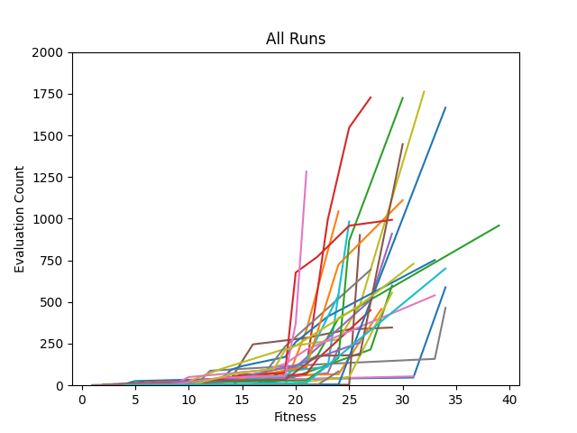

# Introduction

This assignment series takes a step in a different direction than the first assignment series.
Instead of creating a generic evolutionary algorithm the ultimate goal of this series is to create a genetic programming algorithm to solve the task at hand.
The task this time is to play the classic arcade game *Pac-Man*.
Specifically for Assignment 2A, the author is tasked with creating a random search solution; similar to Assignment 1A's main goal.

However, for this assignment, there are some notable changes.
Unlike in Lightup, there are some malicious agents, the Ghosts, which can cause the game to end early.
In a later assignment, we are required to grant those agents with some actual intelligence.
However, for this assignment, each Ghost has a *random action generator* which picks a valid random movement.
In this same vein, Pac-Man is defined to move randomly, however, he is given a little bit more logic than the Ghosts.
He has a *random controller* which determines his move every turn.
A game is played until completion and by that, the authors mean that Pac-Man either consumes all the pills placed throughout the board, he runs out of time, or a Ghost consumes Pac-Man.

# Methodology

## Core Game Logic

The core game logic for the Pac-Man game is implemented in `gpac.py`.
This logic has no notion of evolution algorithms, random searches, or genetic programming.
It only implements the functions needed to play a Pac-Man game, which you can do by playing the `game.py` file or calling `driver.py` with the `demo` flag.

When a GPac object is created it first loads the board passed via the `filename` parameter.
Following this it spawns Pac-Man, the Ghosts, the pills, and the fruit; in that order.
After this, it logs the first turn.
Note each spawn and move is logged to a running string buffer.
This buffer is dumped when the game completes for logging purposes.

Also, somewhat unrelated, most of the methods are prefixed with an underscore which, in Python, notes that it is a private method.
It is not strictly private like in most object-oriented programming languages but it is more of a suggestion to other programmers that they should not call this method directly.

### Spawning Units

Most of the unit spawn code looks pretty similar.
First, the program finds the location for the specific unit.
For units like Ghosts and Pac-Man, the locations are predetermined and always the same.
Ghosts always spawn on top of on another in the bottom right corner and Pac-Man always spawns in the top left corner.
For pills and fruits, there is a chance for a fruit/pill to spawn in a certain cell and those are specified via the initial parameters.
Pills are spawned only at the beginning of the game, although, for fruit there is a chance for one to spawn each turn.
However, there can only be one fruit on the board at a time.
After the location is found for that unit it is placed on the board, and when the function completes the list of locations is returned to be saved.
A simple pseudoscope implementation is below.

```python
unit_locations = []
for unit in total_units:
    location = find_location(unit_type)
    unit_locations += location
    place(location, unit)
return unit_locations
```

Note when spawning pills and fruit they should **not** cover up a Ghost unit as Ghosts have priority.
This was a bug the author encountered in my code initially.
For instance, if a pill were to spawn at [22, 20] and a Ghost was at [22, 21] and if it moved to [22, 20] the Ghost should cover the pill.
However, when he moves off the pill it should be redrawn on the board.
This is solved with the `_redraw_pills_fruits` function.
This function is called per turn after everyone moves and it checks to see if for every pill/fruit their location on the board is empty and if it is to replace it.

```python
def _redraw_pills_fruits(self):
    for pill in self.locations[PILL]:
        if self.board[pill[0]][pill[1]] == EMPTY_CELL:
            self._place(pill, PILL, False)

    fruit_loc = self.locations[FRUIT]
    if fruit_loc and self.board[fruit_loc[0]][fruit_loc[1]] == EMPTY_CELL:
        self._place(fruit_loc, FRUIT, False)
```

### Collision

Unit interaction is pretty important in this game as it is with most video games.
If Pac-Man does not eat pills when he lands on their cell and does not die when he collides with a Ghost nothing would ever happen.
Due to this aspect collision logic has to be implemented.
Pac-Man and the Ghosts have their separate collision logic.

For Pac-Man, if he collides with a pill or fruit the item is consumed and Pac-Man's running item counter is incremented and if he collides with a Ghost the game ends.

```python
def _pacman_collision(self):
    loc = self.locations[PACMAN]

    for i in range(3):
        if loc == self.locations[GHOST[i]]:
            return GHOST_COLLISION  # GAMEOVER

    for pill in self.locations[PILL]:
        # collides with pill
        if loc == pill:
            self.consumed['pill'] += 1
            self.locations[PILL].remove(loc)
            return PILL_COLLISION

    # collides with fruit
    if self.locations[FRUIT] == loc:
        self.consumed['fruit'] += 1
        self.locations[FRUIT] = []
        return FRUIT_COLLISION

    return NO_COLLISION
```

For Ghosts, their collision logic is simpler as they cannot consume fruits or pills.
If a Ghost collides with Pac-Man the game ends.

```python
def _ghost_collision(self, unit_type):

    # ensure type passed is a ghost
    if unit_type not in GHOST:
        return NO_COLLISION

    if self.locations[unit_type] == self.locations[PACMAN]:
        return GHOST_COLLISION
    return NO_COLLISION
```

### Movement

One of the public methods is `move` which is called by whatever utilizes `gPac`.
This function should be called once per unit per turn; so for the three Ghosts and Pac-Man `move` should be called four times per turn.

This function first checks to make sure the game has not ended, if it has it returns as to not move the units after a game over.
It takes in a cardinal direction - `UP`, `DOWN`, `LEFT`, `RIGHT`, and `HOLD` - converts it to an actual location value, and then moves the unit.
After the unit is moved collisions are checked and if a `GHOST_COLLISION` returns the `is_gameover` flag is set.
After that, each unit's turn flag is set this is used in the `turn` function to determine whether a turn is completed.

Additionally, the author could implement a check here to ensure units do not move twice per turn.

```python
def move(self, direction, unit_type):
    if self.is_gameover:
        return

    current_position = self.locations[unit_type]
    new_position = self.cardinal_to_location(direction, current_position, unit_type)

    self.locations[unit_type] = new_position
    self._remove(current_position)
    self._place(new_position, unit_type)

    # check for collisions
    if self._collisions(unit_type) == GHOST_COLLISION:
        self.is_gameover = True

    if unit_type == PACMAN:
        self.pman_turn = True
    elif unit_type == GHOST[0]:
        self.ghost1_turn = True
    elif unit_type == GHOST[1]:
        self.ghost2_turn = True
    elif unit_type == GHOST[2]:
        self.ghost3_turn = True
```

### Turn

The `turn` function should be called whenever all the units have been moved.
It first checks to see if the game is over, if so it returns the score and the world contents.
If the game is not over it checks to see if all the turns have been completed.
If all the turns have been completed the function resets the turn flags, redraws the pills and fruit that may have been covered up checks to see if the game is over based on time or lack of pills.
During this function the game logs itself and increments the timer variable.
It then checks to see if the game is over due to time running out and if it is it returns the score and world contents.
If the game is not over the game attempts to place a fruit.

```python

def turn(self):
    if self.is_gameover:
        return self._calculate_score(), self.world_contents

    if self.pman_turn and self.ghost1_turn and self.ghost2_turn and self.ghost3_turn:
        self._log_turn()

        self.pman_turn = False
        self.ghost1_turn = False
        self.ghost2_turn = False
        self.ghost3_turn = False

        # redraw pills/fruits that may have been covered by ghosts
        self._redraw_pills_fruits()

        if self.time == self.time_elapsed or self.total_pills == self.consumed['pill']:
            self.is_gameover = True
            return self._calculate_score(), self.world_contents

        # replace fruit if fruit is gone
        self.locations[FRUIT] = self._place_fruit()

    return self._calculate_score(), self.world_contents

```

## Evolutionary Programming Framework

The logic for the EP framework is implemented in `solver.py`.
This module utilizes the existing logic of Pac-Man implemented in `gpac.py`
Similar to `gpac.py` it uses Python's private methods.
It takes in a filename which correlates to a JSON file that specifies that parameters that should be used during the experiment.
Also there are two optional parameters to show a progress bar when running the framework and to show the board.
The board parameter is mainly for debugging as it shows each turn as it plays out and can slow down the runtime as it sleeps for 0.10 seconds each turn as to allow the programmer to see the game being played out.

Once the the object is instantiated one should call the `run` function which takes in the map file.
The map file specifies the map that should be used while running the experiment.
Since for this assignment only the Random Search is implemented run simply calls that function.

### Random Search

The core function that runs this whole assignment is `_random_search` which is called via `Solvers` `run` function.
It will iterate through several runs and for each run it will iterate over several evaluations.
Each evaluation a game will be played, its final score will be recorded.
If the score of this specific evaluation is better than the best seen so far in this run it is considered the `highest_solution_in_run` which is used later in logging.
After each run, the `highest_solution_in_run` is compared against the `highest_solution_overall` and if it is better it replaces it for logging purposes.

After all, runs are completed the best scoring individual of all time's world file is logged, it's weight-sensor-value expression is recorded.
Additionally, all the run evaluations are logged as well.

```python

def _random_search(self, map_filepath):
    runs = []
    highest_solution_overall = Solution(0, '', [])

    for _ in range(self.max_runs):

        # play game
        highest_solution_in_run = Solution(0, '', [])
        highest_solution_overall = Solution(0, '', [])
        current_solution = Solution(0, '', [])

        evaluations = collections.OrderedDict()

        for evaluation in range(self.max_evaluations):
            self._create_game(map_filepath)
            pac_weights = self._generate_pacman_weights()
            while not self.game_instance.is_gameover:
                current_score, contents = self._turn(pac_weights)

            current_solution = Solution(current_score, contents, pac_weights)
            if current_solution.fitness > highest_solution_in_run.fitness:
                highest_solution_in_run = current_solution
                evaluations[evaluation] = current_solution

        runs.append(evaluations)

        if highest_solution_in_run.fitness > highest_solution_overall.fitness:
            highest_solution_overall = highest_solution_in_run

    self._log_results(runs, map_filepath)
    self._log_world(highest_solution_overall.contents)
    self._log_solution(highest_solution_overall.weights)
```

### Random Action Generators

Each Ghost's turn is decided by a simple random action generator.
It first looks at all the valid moves a Ghost can make.
For Ghosts they can either move up, down, left, or right; if the move is valid.
A move is not valid for a Ghost if there is a wall in the location.
Ghosts, unlike Pac-Man, cannot hold their position.

Below is the code that handles each Ghost's turn.
It first gets the possible moves for a Ghost which is implemented by the core game logic found in `source/gpac.py`.
After that, it randomly selects a move out of all the possible moves and tells the Ghost to move.

```python
for ghost in gpac.GHOST:
    possible_moves = self.game_instance.get_moves_for_unit(ghost)
    move_choice = random.choice(possible_moves)
    self.game_instance.move(move_choice, ghost)
```

In this code block, the logic for getting moves for a unit is defined.
It uses some additional helper functions.
`get_spot_around_unit` simply gets all the possible physical coordinates around a unit and `location_to_cardinal` converts those physical coordinates to moves such as `UP` or `DOWN`.

```python
def get_moves_for_unit(self, unit_type):

    unit_loc = self.locations[unit_type]
    coords_to_move_to = self.get_spots_around_unit(unit_type)
    movements = []
    if not coords_to_move_to:
        movements.append('BAD')
    else:
        for coord in coords_to_move_to:
            movements.append(self.location_to_cardinal(unit_loc, coord))
    return movements
```

### Random Controller

The random controller looks at a vector of four randomly generated weights that correlate to four sensor values.
The weight vector is defined when the game is instantiated; therefore for each new game, Pac-Man will have new weights.
The generation of these weights can be seen below.

```python
@staticmethod
def _generate_pacman_weights():
    weights = []
    for _ in range(4):
        rng = random.uniform(-1, 1)
        weights.append(rng)
return weights
```

Pac-Man's sensor values are as follows: Manhattan distance to nearest Ghost (G), Manhattan distance to nearest pill (P), number of immediately adjacent walls (W), and Manhattan distance to nearest fruit (F).

#### Sensor Calculations

*Manhattan distance* also referred to as *taxicab geometry*, calculates the distance between two points measured along axes at right angles.
It calculates the absolute difference between two points coordinates.
An implementation of this can be seen below.
Originally, this function used Python's built-in `abs` function but after some basic profiling it seemed that using a branch saved time; even if it looks a little clunkier.
Before that *SciPy's* version was used but that was even slower; which I assume is due to some overhead that balances out for more complicated distance calculations.

```python
@staticmethod
def calculate_manhattan_distance(point_a, point_b):
    distance = (point_a[0] + point_a[1]) - (point_b[0] + point_b[1])
    if distance < 0:
        distance = -distance
    return distance
```

The code to check the closest unit is pretty much identical throughout.
At a high level, it looks at all the units and determines the one that has the minimum manhattan distance to Pac-Man's possible location.

Out of all the sensor value calculations functions `_closest_pill` is the most expensive.
This is mainly because there are a large number of pills per game instance.
The performance of this could be improved by implementing the shortest path algorithm but the author did not believe at this point it was necessary.

```python
def _closest_pill(self, cell):
    pill_locations = self.game_instance.locations[gpac.PILL]

    min_distance = self._calculate_manhattan_distance(cell, pill_locations[0])

    for pill_loc in pill_locations[1:]:
        current_distance = self._calculate_manhattan_distance(cell, pill_loc)
        if min_distance > current_distance:
            min_distance = current_distance

    return min_distance
```

#### Move Score

For each possible move, the sensor values are calculated for that position.
The sensor values are then multiplied with their relating weights and summed.
A dictionary paring a move with its score is then returned.

```python
def _calculate_move_scores(self, pac_weights):

    move_choices = {}
    for move in self.game_instance.get_spots_around_unit(gpac.PACMAN):
        sensor_values = self._generate_sensor_inputs(move)

        move_score = sum([sensor * weight for sensor,
                            weight in zip(sensor_values, pac_weights)])

        pacman_loc = self.game_instance.locations[gpac.PACMAN]
        move_direction = self.game_instance.location_to_cardinal(pacman_loc, move)

        move_choices[move_direction] = move_score
    return move_choices
```

The best score will be selected and Pac-Man's random controller will move Pac-Man in that direction.
For instance say Pac-Man could move up, down, or hold.
If the score for moving up is 10 while the score for moving down is -1 and the score for holding is 0 the random controller would select to move up.

This logic can be seen in the two following code blocks.

```python
@staticmethod
def _select_best_move(move_scores):
    max_score = max(move_scores.values())
    pacman_move = None
    for move_direction in move_scores.keys():
        if move_scores[move_direction] == max_score:
            pacman_move = move_direction
            break
    return pacman_move
```

```python
# calculates best move for pac-man
move_scores = self._calculate_move_scores(pac_weights)

pacman_move = self._select_best_move(move_scores)

# move pacman
self.game_instance.move(pacman_move, gpac.PACMAN)
```

### Logging

For this assignment, a few files were required to be logged.
First, the solution file will be discussed.

#### Solution File

This assignment's solution file will look pretty drastically different than future assignments.
Mainly because the future assignments will be using a tree structure and this one did not.
The solution file logs the best solution out of all the run's expression.
This expression consists of the formula that calculates the score for a move as discussed earlier.
Therefore, it is comprised of random weights along with some variable names.

For instance if for the best solution the weights where determined to be `.05, -.10, -.25, .20` then the solution file would contain `.05*G + -.10*P + -.25*W + .20*F`

#### World File

Not only is the best solutions expression recorded but the entirety of the game is also logged.
Each unit's creation and movement are logged to a world buffer and at the end of the game, the buffer is returned.
One can replay the game with a visualizer like the one found [here](https://bonsai.auburn.edu/dtauritz/courses/ec/intro/2020fall/visualizer.html) with the world file.

#### Log Runs

For each run, its evaluations are logged.
However, only solutions that have improved on the previous highest score are logged.
Therefore if for one run all evaluations calculate a score of 10 only the first 10 is logged.
Additionally, at the beginning of the log file, metadata for the experiment is logged such as the seed used, the pill density, etc.

# Results

For green 2 the author was specified three different configurations to run experiments on.
All configurations should run for 30 runs and 2,000 evaluations.

1. Configuration 1 had 50% pill density, 1% fruit spawn chance, a fruit score of 10, and a time multiplier of 2.
2. Configuration 2 had 80% pill density, 1% fruit spawn chance, a fruit score of 10, and a time multiplier of 2.
3. Configuration 3 had 50% pill density, 100% fruit spawn chance, a fruit score of 10, and a time multiplier of 2.

The specific configurations can be seen in the Appendix.

As one would expect running all these experiments takes quite some time.
Especially because most of the time the cause of a game over in this assignment is running out of time.
Due to the limited intelligence of the Ghosts and Pac-Man, it is rare for Pac-Man to win by consuming all the pills or for the Ghosts to kill him.
One experiment takes around 4-5 hours, on average, to run.
Due to this my benchmark code implemented Python's Multiprocessing module to all the experiments to run in parallel.
Running the benchmark code took around seven hours.

## Configuration 1

In Figure \ref{c1_best} one can see the results for running this problem over map0.txt.
As expected, all these graphs show that the model does not perform fantastically.
The best score Pac-Man achieves across all experiments is 30.
The results for all the runs for configuration 1 can be seen in Figure \ref{c1_all}.

{ width=500px }

## Configuration 2

For this configuration, pill density is higher.
Therefore there are more pills for Pac-Man to consume.
Because of this one can see that it is easier for Pac-Man to get a higher score.
This is seen as even at a low evaluation counter Pac-Man is getting a score.
On the other configurations, Pac-Man usually does not get a score until later, just due to the random nature.
One can see the results in Figure \ref{c2_best} and one can also see all the runs recorded in the appendix in Figure \ref{c2_all}.

{ width=500px }

## Configuration 3

For the last configuration, the pill density was brought back down, but the fruit spawn chance was increased.
Consuming fruit does not make the game end faster, however, it does increase Pac-Man's score.
This fact explains why for configuration 3 Pac-Man achieves the highest score which the author believes is due to his consumption of fruit.
The best run's results can be seen in Figure \ref{c3_best} and all the results can be seen in the appendix in Figure \ref{c3_all}.

{ width=500px }

# Conclusion

Most of the work for this assignment was building Pac-Man's core logic.
Testing originally was rather difficult but once the author built the game module it became simpler to test as they could just play the game and see if it was working as intended.
Implementing the random search was not rather difficult as it is fairly straight forward.
The biggest concern came from Pac-Man's movement logic and the efficiency of the runtime.

There were plenty of examples, when the author visually inspected a game's snapshots, of Pac-Man running around consuming pills and then hitting a wall and sitting there for fifty or so turns.
After debugging through the code, and discussing with other teaching assistants, the author concluded that this was intended behavior.
This behavior happens as the weights are randomly generated so there are plenty of times where Pac-Man may not want to do anything due to how the math adds up.

Pac-Man's lack of intelligence aside the second biggest concern as stated previously was the runtime.
The author used Python's built-in profiling modules (cProfile) to determine if any functions took an exuberant amount of time.
The function that consumed the most amount of time was the one that calculated the manhattan distance, however, this function was also the one that was called the most so it is expected for its time to be high.
Note the time for a function is not looking at the individual time spent there but the cumulative time spent there out of all the calls to that function.
A function that had a relatively low number of calls but a high amount of time spent inside it was the function checking for the closest pill.
This is also not surprising as the algorithm that searches for the nearest pill is rather naive.
After talking to the teaching assistants the author decided not to focus too much on optimization as the runtime was not too high.
However, two solutions for optimization in the future are increasing the amount of parallelized code and to implement the shortest path algorithm for calculating the nearest pill.

Overall the assignment was extremely fun to work on.
It was fairly depressing watching Pac-Man on replays do well and then just decide to give up on life.
However, the author thinks for future assignments it will be very interesting to see how Pac-Man's intelligence improves and eventually the Ghost's intelligence.

# Appendix

## Configurations

### Configuration 1\label{config1}

```json
{
    "algorithm": "random",

    "max_runs": 30,
    "max_evaluations": 2000,

    "pill_density": 0.5,
    "fruit_spawn_probability": 0.01,
    "fruit_score": 10,
    "time_multiplier": 2,

    "log_file": "./logs/g1/config1.log",
    "solution_file": "./solutions/g1/config1_solution.txt",
    "highest_score_file": "./worlds/g1/config1_world.txt"
}
```

### Configuration 2

```json
{
    "algorithm": "random",

    "max_runs": 30,
    "max_evaluations": 2000,

    "pill_density": 0.8,
    "fruit_spawn_probability": 0.01,
    "fruit_score": 10,
    "time_multiplier": 2,

    "log_file": "./logs/g1/config2.log",
    "solution_file": "./solutions/g1/config2_solution.txt",
    "highest_score_file": "./worlds/g1/config2_world.txt"
}
```

### Configuration 3

```json
{
    "algorithm": "random",

    "max_runs": 30,
    "max_evaluations": 2000,

    "pill_density": 0.5,
    "fruit_spawn_probability": 1,
    "fruit_score": 10,
    "time_multiplier": 2,

    "log_file": "./logs/g1/config3.log",
    "solution_file": "./solutions/g1/config3_solution.txt",
    "highest_score_file": "./worlds/g1/config3_world.txt"
}
```

## Graphs

{ width=500px }

{ width=500px }

{ width=500px }
