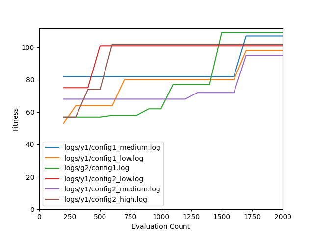

# Introduction

For this assignment, the author was tasked with implementing a more advanced controller for Pac-Man specifically a *GP tree controller*.
Unlike in Assignment 2A where every game used the same formula to dictate Pac-Man's moves, the GP tree controller can vary between games.
The ghosts still have the same controller as in Assignment 2A.
The main focus of this assignment is to give Pac-Man some more intelligence with his move choices.

# Methodology

## Node Class

Since with this assignment the controller is comprised of nodes that build a tree the author first started with creating a class to implement this logic.

### Node Init

```python
class Node:
    def __init__(self, depth=0, children=None, data=None, tree_type='grow', max_depth=4):
        self.tree_type = tree_type
        self.max_depth = max_depth
        self.depth = depth
        if data:
            self.data = data
        else:
            self.data = self.generate_value()
        if children:
            self.children = children
        else:
            self.children = [None, None]
        self.height = None
```

The Node class's variables are fairly simple.
There is a data variable that contains either an operation value or a sensor value.
For this assignment the author was required to implement the following operations: multiplication ('*'), addition ('+'), subtraction ('-'), division ('/'), and a random value selector ('RAND').
For sensors the choices are ghost distance ('G'), pill distance ('P'), fruit distance ('F'), adjacent walls ('W'), or a constant value ('C').
If no data variable is passed one is generated on the fly.
The depth denotes how deep the node is in the tree, if it is the root node the depth will be 0, and its children will have a depth of 1.
Each tree when being generated cannot exceed the max depth value.
The author decided that on recombination to ignore the max depth value to see if more beneficial trees could be generated.
They also believe parsimony pressure would take care of the bloated trees.
Every node can have two children, sensor nodes have zero children, while operation nodes have two.
Each tree can be of two types *grow* or *full*.
In a *full* tree every branch of the tree has a depth equal to the max depth and for a *grow* tree branches are not required to have max depth.

### Node Value Generation

```python
def generate_value(self):
    """ Generate value for node. """

    if self.depth >= self.max_depth - 1:
        value = self.generate_sensor()

    else:
        if self.tree_type == 'full' or self.depth == 0 or random.randint(0, 1):
            value = random.choice(operations)
        else:
            value = self.generate_sensor()
    return value
```

In the prior section, it was discussed how if no data variable is passed it is generated on the fly.
The `generate_value` function handles that.
First, it checks to see if the depth of the node is at the max depth and if its value of this node is a sensor value.
If an operations value was generated it would have children that would exceed the max depth.

If a sensor value is selected then a random value is picked from the sensor list.
If that value is the constant value then a random float is generated.

```python
@staticmethod
def generate_sensor():
    value = random.choice(sensors)
    if value == CONSTANT:
        value = random.randint(-10, 10)
    return value
```

### Tree Creation

The `grow()` function is one of the most important functions for the node class.
It allows a tree to be grown from the root node.

This will loop for each child of the node it is currently looking at and create a new node instance.
After that, if the new child contains an operation value it will call grow on itself and repeat the process.

```python
def grow(self):
    if self.children != [None, None]:
        raise MyException("Error: Grow has been called twice on the same node")

    depth = self.depth + 1

    # loop for each child
    for element in range(2):
        if depth >= self.max_depth:
            break
        current = Node(depth, tree_type=self.tree_type, max_depth=self.max_depth)
        if current.data in operations:
            current.grow()
        self.children[element] = current

    self.get_height()
```

### Swapping Nodes

For recombination, two nodes' values need to be swapped, which is slightly more complicated than it sounds.
All the children that originally were in the original node need to be swapped over.
After that, all the children and the new node's depth and height need to be updated.

The functions `update_depth` and `get_height` just recursively call themselves on their children until they reach the bottom of the tree.

```python
def swap(self, other):
    self.data = other.data
    self.children = other.children

    self.update_depth(self.depth)
    self.get_height()

def update_depth(self, depth):
    self.depth = depth
    for child in self.children:
        if child:
            child.update_depth(self.depth + 1)

def get_height(self):
    if self.children[0]:
        child_one_height = self.children[0].get_height()
    else:
        child_one_height = -1

    if self.children[1]:
        child_two_height = self.children[1].get_height()
    else:
        child_two_height = -1

    height = max(child_one_height, child_two_height) + 1

    self.height = height
    return height
```

### Utility Functions

Below are some functions that are used mainly by the `solver` class.
`to_list` converts the node and its children into a list of lists.
The top-level list has *n* elements where *n* is equal to the height of the root node.
Each node at depth *b* is then placed at element *b* in the top-level list.

```python
def to_list(self, node_list=None):
    if not node_list:
        node_list = []
        for _ in range(self.get_height() + 1):
            node_list.append([])
    node_list[self.depth].append(self)
    for child in self.children:
        if child:
            node_list = child.to_list(node_list)
    return node_list
```

`get_total_nodes` simply goes through the node and its children to see how many nodes exist.
`parse_tree` returns the node and its children as a string to be used for logging purposes.

```python
def get_total_nodes(self, count=1):
    for child in self.children:
        if child:
            count = 1 + child.get_total_nodes(count)
    return count

def parse_tree(self, prior='', depth=0):
    output = depth * '|' + str(self.data) + "\n"
    if self.children[0] is not None:
        output = self.children[0].parse_tree(output, depth=depth + 1)
    if self.children[1] is not None:
        output = self.children[1].parse_tree(output, depth=depth + 1)
    output = prior + output
    return output
```

### Evaluate Tree

The tree's purpose is to encode an expression that needs to be evaluated by the `solver` object.
The value returned by the expression allows the Pac-Man controller to determine where to move.
Therefore, there needs to be some functionality that takes in the root node and its children and evaluates the expression they as a whole create; this is handled by `calculate`.

`calculate` takes in the four sensor values that are needed by the nodes to fully evaluate the expression.
For each child at the current node, it calls `calculate` and eventually the node will not contain an operation value, therefore it will have no children and will just be a constant value.
This value is retrieved via `placeholder_to_value` and returned.

```python
def calculate(self, ghost_distance, pill_distance, walls, fruit_distance):
    if self.data in operations:
        value1 = self.children[0].calculate(
            ghost_distance, pill_distance, walls, fruit_distance)
        value2 = self.children[1].calculate(
            ghost_distance, pill_distance, walls, fruit_distance)
        output = operation_functions[self.data](value1, value2)
        return output

    return self.placeholder_to_value(ghost_distance, pill_distance, walls, fruit_distance)

def placeholder_to_value(self, ghost_distance, pill_distance, walls, fruit_distance):
    data = self.data
    if data == GHOST_DISTANCE:
        data = ghost_distance
    elif data == PILL_DISTANCE:
        data = pill_distance
    elif data == WALL_DISTANCE:
        data = walls
    elif data == FRUIT_DISTANCE:
        data = fruit_distance
    return data
```

## Solver

### Init

For solver, it pretty much uses the same overall architecture that the later Lightup Assignments used.
There are dictionaries for each selection algorithm that encode strings to functions that allow simpler flow control.
For instance, for parent selection, we have two algorithms FPS and over-selection.

```python
self.parent_fps = {'fps': self.fitness_proportional_selection}
self.parent_over_selection = {'over-selection': self.over_selection}
self.parent_algs = {**self.parent_fps, **self.parent_over_selection}
```

When it comes time to select the parent algorithm the code calls the following code.
Based on the configuration file the user can provide a `parent_selection_alg` this is pulled and used as a key in the `parent_algs` dictionary.
The corresponding function is returned and called with a parameter of the population.

```python
population = self.parent_algs[self.parent_selection_alg](population)
```

### Run

The main public function `run` is called by the user.
It will run the GP framework for as many times specified in the configuration file passed when initializing the solver object.
Unlike last time a user-specified map is not provided to map; this time is it picked at random.
Run will select all the possible maps located in the map directory and set it as a class variable.
Then later when the game is actual created a random map is picked, per game.

```python
def run(self):
    """ Runs solver against a specific map. """
    self._set_seed()
    maps = glob.glob('./maps/map*.txt')
    self.maps = maps
    self._genetic_programming()
```

### Genetic Programming

The main `_genetic_programming` function is fairly lengthy and probably could be refactored some due to this it is not in the report but can be seen in the source code.
However, it is pretty much identical to its counterpart found in Lightup.

First, an initial population is created, following these parents are selected from the population, then children are created. After children are created they are merged with the existing population and some individuals are culled out of the population with the survival selection function.
Now, this new population is used for parent selection and the process is repeated until the maximum number of evaluations is hit.
After this occurs it is run again from the beginning until the maximum number of runs occur.

Throughout this process, the best individuals per run are recorded and the best individual of all time is tracked for logging purposes.


### Parent Selection

The author decided not to discuss the implementation of FPS as it is the same as the one in the Lightup Assignment.
The same goes for the survival algorithms (truncation and tournament selection) and the termination algorithms (number of evaluations and no change).
However, there was a new parent selection algorithm added with this assignment *Over-Selection*.
With over-selection one splits the population into two groups, the top x%, and the other (100-x)%.
After that 80% of the selected individuals will come from the top x% and the remaining 20% will come from the other group.

`x` is determined via the configuration file passed during init.
For all the experiments discussed later, it was set to 32%.

```python
def over_selection(self, individuals):
    sorted_population = sorted(individuals, reverse=True)
    num_of_individuals = len(sorted_population)
    top_n = self.top_x_percent * num_of_individuals

    top_population = sorted_population[top_n:]
    bottom_population = sorted_population[:top_n]

    top = random.choices(top_population, k=.8 * num_of_individuals)
    bottom = random.choices(bottom_population, k=.2 * num_of_individuals)

    return top + bottom
```

### Indidiviual Creation

The function to create children is also fairly similar to Lightup.
However, this mutation and crossover cannot both occur it is one or the other.
Additionally, multiprocessing has been implemented via `create_individuals` which will be discussed later.

```python
def child_selection(self, population):
    children = []
    for _ in range(self.children):
        parent_one, parent_two = random.sample(population, 2)
        parent_one = parent_one.head_node
        parent_two = parent_two.head_node
        rng = random.random()
        if rng < self.mutation_rate:
            # mutate
            if random.randint(0, 1):
                parent = parent_one
            else:
                parent = parent_two
            child_node = self.sub_tree_mutation(parent)
        else:
            child_node = self.sub_tree_crossover(parent_one, parent_two)
        children.append(child_node)

    return self.create_individuals(children)
```

Creating the initial population is pretty simple as well.
First, a tree type is a selection, a node is created, and then grow is called on that node.
After $\mu$ trees are created they are passed to `create_individuals`.

```python
def _create_initial_population(self):
    population = []
    if self.show_progress_bar:

        run_range = tqdm.tqdm(range(self.parents), "Initial Population",
                                position=1, leave=False, total=self.parents)
    else:
        run_range = range(self.parents)

    for _ in run_range:
        # create tree
        if random.randint(0, 1):
            tree_type = 'full'
        else:
            tree_type = 'grow'
        head = node.Node(tree_type=tree_type, max_depth=self.max_depth)
        head.grow()
        population.append(head)


    return self.create_individuals(population)
```

`create_individuals` uses Python's multiprocessing module.
This allows the program to run multiple game instances at the same time without this every game has to be played to completion sequentially which can slow down the runtime considerably.

```python
def create_individuals(self, population):
    out = []
    with multiprocessing.Pool() as pool:
        for i, res in enumerate(pool.imap_unordered(self.calculate_fitness, population)):
            out.append(res)
    return out
```

`calculate_fitness` is pretty much the same as it was before however, it has been adapted to use head instead of a list of weights and the parsimony penalty has been added.

```python
def calculate_fitness(self, head):
    current_score = 0
    contents = ''

    self._create_game()
    while not self.game_instance.is_gameover:
        current_score, contents = self._turn(head)

    if self.parsimony_type == "total":
        count = head.get_total_nodes()
    else:
        count = head.get_height()
    penalty = self.parsimony_penalty * count
    final_score = current_score - penalty
    current_solution = individual.Individual(final_score, contents, head)
    return current_solution
```

### Turns

Most of the code relating to turns, sensor calculation, etc has not been touched.
However, there are the first areas where some portions have been modified.
For instance `_calucate_move_scores` had to be updated to handle the new Node object.
Now it calls `calculate` which was discussed earlier and passes all the sensor values to it.

```python
def _calculate_move_scores(self, root_node):
    move_choices = {}
    for move in self.game_instance.get_spots_around_unit(gpac.PACMAN):
        sensor_values = self._generate_sensor_inputs(move)

        move_score = root_node.calculate(*sensor_values)

        pacman_loc = self.game_instance.locations[gpac.PACMAN]
        move_direction = self.game_instance.location_to_cardinal(pacman_loc, move)

        move_choices[move_direction] = move_score
    return move_choices
```

Another function that was improved and modified was `_closest_pill`.
In Assignment 2A it searched through all the pills and compared their distances to the passed cell location.
This did not perform well but it worked well enough.
However, this time it was slogging down the runtime far too much so a breadth-first search algorithm was used to find the closest pill.

```python
    def _closest_pill(self, cell):
        """ Calculate manhattan distance for closest pill to Pac-Man. """
        min_distance = 0
        seen = [cell]
        possible_locations = [cell]
        found = False
        while not found:
            current = possible_locations.pop()

            if self.game_instance.board[current[0]][current[1]] == gpac.PILL:
                found = True
                min_distance = self._calculate_manhattan_distance(cell, current)
                break

            locations = self.game_instance.get_all_spots_around_cell(current)
            for location in locations:
                if location not in seen:
                    seen.append(location)
                    possible_locations.append(location)

        return min_distance
```

### Logging

Unlike in 2A the solution that must be logged is not static across all runs.
Therefore as discussed earlier `parse_tree` was implemented in the node class.
This is passed to `_log_solution` as it expected a string to print to the file.

The result logging function was modified as well as it required the average fitness and the best fitness per run to be logged per generation.

# Results

The experiments ran this time were the same configuration-wise as the last assignment.
The first configuration had a 50% pill density, 1% fruit spawn probability, 10 points for a fruit score, and a time multiplier of 2.
The second configuration had an 80% pill density with the same values for the other parameters.
The third configuration had a pill density of 50% and a fruit spawn probability of 100% with the same values for the last two parameters.
A graph comparing the average fitness across evaluations for the best run can be seen in Figure \ref{all_avg}.
An additional graph comparing the best fitness across all evaluations for the best run can be seen in Figure \ref{best_avg}.

It would seem that the second configuration file performs the best out of all three configuration files.
This is the one with a high pill density which makes sense as Pac-Man can easier get higher scores as there are more pills to consume.
It seems that configuration 3 reaches a higher fitness first but unfortunately gets stuck in a local maximum that it cannot escape.

More details statistical analysis can be seen in Figures \ref{c1_2_stat}, \ref{c2_3_stat}, \ref{c1_3_stat}
Configuration 1 has the lowest variance, however, configuration 2 has the highest mean and the highest overall value.

# Parsimony

Parsimony pressure was implemented to keep the bloat down.
There are two parsimony techniques used in the GPac framework: tree depth vs tree size.
For tree size, you would count the total number of nodes found in the tree and multiple that value by a parsimony weight.
For tree depth, the depth of the tree is used to multiply against the parsimony weight.
Parsimony weight is configured via the config files and three different weights were tested: 100%, 50%, and 25%.

## Total Nodes

Figure \ref{parsimony_total_avg} shows the average fitness per evaluation for the best run across all three different parsimony weights.
It would seem that a low parsimony weight is preferable for a more equal distribution.
However as one can see in Figure \ref{parsimony_total_best} which shows the best fitness low parsimony is the worst performing experiment.
When looking at the best fitness high parsimony performs the best.
The author would have expected larger trees to create more diverse expressions that could lead to interesting logic but it would seem simpler trees are good enough.

Figures \ref{low_medium_total_stat}, \ref{medium_high_total_stat}, \ref{low_high_total_stat} show some statistical analysis between the different parsimony weights.
As pointed out earlier it would seem that low parsimony leads to a lower variance compared to the other weights.

## Depth

Using tree depth gave similar results as total nodes.
These graphs can be seen in Figures \ref{parsimony_height_avg} and \ref{parsimony_height_best}

Some statistical analysis of the different weights for depth can be seen in Figures \ref{low_medium_depth_stat}, \ref{medium_high_depth_stat}, \ref{low_high_depth_stat}
Compared to total nodes a medium weight leads to a more stabilized variance.

## Total Nodes vs Depth

However, when looking at total nodes vs depth it would seem that total nodes outperform depth.
This can be seen in Figures \ref{parsimony_total_avg} and \ref{parsimony_total_best}.
The author's assumption behind this is that the depth it only shows how deep a tree is but not how wide it can be.
With depth, one could just have a very narrow tree so it does not fully encompass the bloat of the tree.
However, with total nodes, one can more easily see how large the tree is.

# Conclusion

This was an interesting assignment as for the first time in this class the author was able to implement genetic programming.
Originally, the idea of a tree-based structure seemed daunting as it was not something the author had to for a while.
However, it turned out to not be too bad especially when recursion was used.

The main deadlock with this assignment has been performed.
Originally, without multiprocessing, one run with 2,000 evaluation would take around twenty minutes.
However, once multiprocessing was implemented it brought the run down to two and a half minutes which is a gigantic performance gain.

Pac-Man did not perform as well as expected and the author is unsure as to why exactly this happened.
The main theory is the operation types and perhaps if more operations were added there could be some more variety in the solutions to lead to better performing controllers.

# Appendix

## Configurations

### Green 2 Configuration 1\label{g2_1}

```json
{
    "algorithm": "gp",
    "max_runs": 30,
    "max_evaluations": 2000,
    "pill_density": 0.5,
    "fruit_spawn_probability": 0.01,
    "fruit_score": 10,
    "time_multiplier": 2,
    "children": 100,
    "parents": 200,
    "max_depth": 3,
    "parsimony": 1,
    "parsimony_type": "count",
    "termination_alg": "num of evals",
    "parent_selection_alg": "fps",
    "survival_selection_alg": "truncation",
    "mutation_rate": 0,
    "top_x_percent": 0.32,
    "log_file": "./logs/g2/config1.log",
    "solution_file": "./solutions/g2/config1_solution.txt",
    "highest_score_file": "./worlds/g2/config1_world.txt"
}
```

### Green 2 Configuration 2\label{g2_2}

```json
{
    "algorithm": "gp",
    "max_runs": 30,
    "max_evaluations": 2000,
    "pill_density": 0.8,
    "fruit_spawn_probability": 0.01,
    "fruit_score": 10,
    "time_multiplier": 2,
    "children": 100,
    "parents": 200,
    "max_depth": 3,
    "parsimony": 1,
    "parsimony_type": "count",
    "termination_alg": "num of evals",
    "parent_selection_alg": "fps",
    "survival_selection_alg": "truncation",
    "mutation_rate": 0,
    "top_x_percent": 0.32,
    "log_file": "./logs/g2/config2.log",
    "solution_file": "./solutions/g2/config2_solution.txt",
    "highest_score_file": "./worlds/g2/config2_world.txt"
}
```

### Green 2 Configuration 3\label{g2_3}

```json
{
    "algorithm": "gp",
    "max_runs": 30,
    "max_evaluations": 2000,
    "pill_density": 0.5,
    "fruit_spawn_probability": 1,
    "fruit_score": 10,
    "time_multiplier": 2,
    "children": 100,
    "parents": 200,
    "max_depth": 3,
    "parsimony": 1,
    "parsimony_type": "count",
    "termination_alg": "num of evals",
    "parent_selection_alg": "fps",
    "survival_selection_alg": "truncation",
    "mutation_rate": 0,
    "top_x_percent": 0.32,
    "log_file": "./logs/g2/config3.log",
    "solution_file": "./solutions/g2/config3_solution.txt",
    "highest_score_file": "./worlds/g2/config3_world.txt"
}
```

### Yellow 1 Low 1\label{y1_low_1}

```json
{
    "algorithm": "gp",
    "max_runs": 30,
    "max_evaluations": 2000,
    "pill_density": 0.5,
    "fruit_spawn_probability": 0.01,
    "fruit_score": 10,
    "time_multiplier": 2,
    "children": 100,
    "parents": 200,
    "max_depth": 3,
    "parsimony": 0.25,
    "parsimony_type": "count",
    "termination_alg": "num of evals",
    "parent_selection_alg": "fps",
    "survival_selection_alg": "truncation",
    "mutation_rate": 0,
    "top_x_percent": 0.32,
    "log_file": "./logs/y1/config1_low.log",
    "solution_file": "./solutions/y1/config1_low.txt",
    "highest_score_file": "./worlds/y1/config1_low.txt"
}
```


### Yellow 1 Medium 1\label{y1_medium_1}

```json
{
    "algorithm": "gp",
    "max_runs": 30,
    "max_evaluations": 2000,
    "pill_density": 0.5,
    "fruit_spawn_probability": 0.01,
    "fruit_score": 10,
    "time_multiplier": 2,
    "children": 100,
    "parents": 200,
    "max_depth": 3,
    "parsimony": 0.5,
    "parsimony_type": "count",
    "termination_alg": "num of evals",
    "parent_selection_alg": "fps",
    "survival_selection_alg": "truncation",
    "mutation_rate": 0,
    "top_x_percent": 0.32,
    "log_file": "./logs/y1/config1_medium.log",
    "solution_file": "./solutions/y1/config1_medium.txt",
    "highest_score_file": "./worlds/y1/config1_medium.txt"
}
```

### Yellow 1 High 1\label{y1_high_1}

```json
{
    "algorithm": "gp",
    "max_runs": 30,
    "max_evaluations": 2000,
    "pill_density": 0.5,
    "fruit_spawn_probability": 0.01,
    "fruit_score": 10,
    "time_multiplier": 2,
    "children": 100,
    "parents": 200,
    "max_depth": 3,
    "parsimony": 1,
    "parsimony_type": "count",
    "termination_alg": "num of evals",
    "parent_selection_alg": "fps",
    "survival_selection_alg": "truncation",
    "mutation_rate": 0,
    "top_x_percent": 0.32,
    "log_file": "./logs/y1/config1_high.log",
    "solution_file": "./solutions/y1/config1_high.txt",
    "highest_score_file": "./worlds/y1/config1_high.txt"
}
```

### Yellow 1 Low 2\label{y1_low_2}

```json
{
    "algorithm": "gp",
    "max_runs": 30,
    "max_evaluations": 2000,
    "pill_density": 0.5,
    "fruit_spawn_probability": 0.01,
    "fruit_score": 10,
    "time_multiplier": 2,
    "children": 100,
    "parents": 200,
    "max_depth": 3,
    "parsimony": 0.25,
    "parsimony_type": "height",
    "termination_alg": "num of evals",
    "parent_selection_alg": "fps",
    "survival_selection_alg": "truncation",
    "mutation_rate": 0,
    "top_x_percent": 0.32,
    "log_file": "./logs/y1/config2_low.log",
    "solution_file": "./solutions/y1/config2_low.txt",
    "highest_score_file": "./worlds/y1/config2_low.txt"
}
```

### Yellow 1 Medium 2\label{y1_medium_2}

```json
{
    "algorithm": "gp",
    "max_runs": 30,
    "max_evaluations": 2000,
    "pill_density": 0.5,
    "fruit_spawn_probability": 0.01,
    "fruit_score": 10,
    "time_multiplier": 2,
    "children": 100,
    "parents": 200,
    "max_depth": 3,
    "parsimony": 0.5,
    "parsimony_type": "height",
    "termination_alg": "num of evals",
    "parent_selection_alg": "fps",
    "survival_selection_alg": "truncation",
    "mutation_rate": 0,
    "top_x_percent": 0.32,
    "log_file": "./logs/y1/config2_medium.log",
    "solution_file": "./solutions/y1/config2_medium.txt",
    "highest_score_file": "./worlds/y1/config2_medium.txt"
}
```

### Yellow 1 High 2\label{y1_high_2}

```json
{
    "algorithm": "gp",
    "max_runs": 30,
    "max_evaluations": 2000,
    "pill_density": 0.5,
    "fruit_spawn_probability": 0.01,
    "fruit_score": 10,
    "time_multiplier": 2,
    "children": 100,
    "parents": 200,
    "max_depth": 3,
    "parsimony": 1,
    "parsimony_type": "height",
    "termination_alg": "num of evals",
    "parent_selection_alg": "fps",
    "survival_selection_alg": "truncation",
    "mutation_rate": 0,
    "top_x_percent": 0.32,
    "log_file": "./logs/y1/config2_high.log",
    "solution_file": "./solutions/y1/config2_high.txt",
    "highest_score_file": "./worlds/y1/config2_high.txt"
}
```

## Graphs

{ width=400px }

{ width=400px }

{ width=400px }

{ width=400px }

{ width=400px }

{ width=400px }

{ width=400px }

{ width=400px }


## Stats

{ width=400px }

{ width=400px }

{ width=400px }

{ width=400px }

{ width=400px }

{ width=400px }

{ width=400px }

{ width=400px }

{ width=400px }
